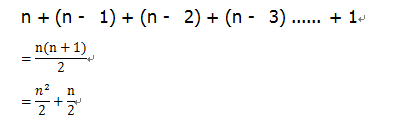
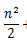
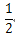
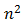
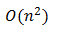
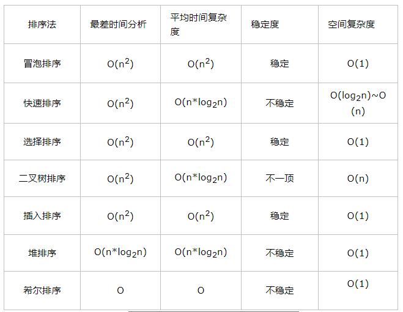

## 算法复杂度
算法复杂度分为时间复杂度和空间复杂度，一个好的算法应该具体执行时间短，所需空间少的特点。
随着计算机硬件和软件的提升，一个算法的执行时间是算不太精确的。只能依据统计方法对算法进行估算。我们抛开硬件和软件的因素，算法的好坏直接影响程序的运行时间。

### 例子
```
int value = 0;                      // 执行了1次
for (int i = 0; i < n; i++) {       // 执行了n次
      value += i;
}
```
这个算法执行了 1 + n 次，如果n无限大，我们可以把前边的1忽略，也就是说这个算法执行了n次
时间复杂度常用大O符号表示，这个算法的时间复杂度就是O(n).
概念： 一般情况下，算法的基本操作重复执行的次数是模块n的某一函数f(n),因此，算法的时间复杂度记做 T(n) = O(f(n))。 随着模块n的增大，算法执行的时间增长率f(n)的增长率成正比，所以f(n)越小，算法 的时间复杂度越低，算法的效率越高。
### 计算时间复杂度
1. 去掉运行时间中的所有加法常数。
2. 只保留最高阶项。
3. 如果最高阶项存在且不是1，去掉与这个最高阶相乘的常数得到时间复杂度

#### 例子
```
for (int i = 0; i < n; i++) {
     for (int j = i; j < n; j++) {
          // do .....
     }
}
```
当 i = 0 时 里面的fo循环执行了n次，当i等待1时里面的for循环执行了n -  1次，当i 等于2里里面的fro执行了n - 2次........所以执行的次数是



根据我们上边的时间复杂度算法
1. 去掉运行时间中的所有加法常数： 没有加法常数不用考虑
2. 只保留最高阶项:　只保留 
3. 去掉与这个最高阶相乘的常数:  去掉  只剩下 
最终这个算法的时间复杂度为

再看一个线性的
​      for ( int i = 0; i < n; i++) {
​          // do .....
​     }
​     因为循环要执行n次所以时间复杂度为O(n)

其它的我也就不一个一个算了，下面给出了常用的时间复杂度



| 排序法 | 最差时间分析 | 平均时间复杂度 |	稳定度 |	空间复杂度 |
| ---- | ---- | ---- | ---- | ---- |
| 冒泡排序	| O($n^{2}$) | O($n^{2}$) | 稳定| 	O(1)|
| 快速排序	| O($n^{2}$) | O(n*$log_(2)$$^(n)$) | 不稳定 |  O(log2n)~O(n) |
| 二叉树排序	| O(n2)| O(n*log2n)	| 不一顶| 	O(n)|
| 插入排序  |     O(n2)	| O(n2)| 	稳定| 	O(1)|
| 堆排序	|    O(n*log2n)	| O(n*log2n)| 不稳定 |O(1)|
| 希尔排序	| O| 	O	| 不稳定	| O(1)|

 