## DevOps 理念

### DevOps究竟是什么

> DevOps（Development和Operations的组合词）是一种重视“软件开发人员（Dev）”和“IT运维技术人员（Ops）”之间沟通合作的文化、运动或惯例。透过自动化“软件交付”和“架构变更”的流程，来使得构建、测试、发布软件能够更加地快捷、频繁和可靠。——维基百科
>
> DevOps是一种文化转变，或者说是一个鼓励更好地交流和协作（即团队合作）以便于更快地构建可靠性更高、质量更好的软件的运动。——Mike Kavis
>

Mike Kavis是美国Cloud Technology Partners公司的副总裁兼首席架构师，他也更加详细地描述介绍说：DevOps是软件开发生命周期（SDLC）从瀑布式到敏捷再到精益的发展。DevOps超越了敏捷，它的关注点是从SDLC中移除浪费。通常情况下，发现浪费或者瓶颈的形式包括：不一致的环境，人工的构建和部署流程，差的质量和测试实践，IT部门之间缺少沟通和理解，频繁的中断和失败的协定以及那些需要珍贵的资源、花费重要的时间和金钱才能保持系统运行的全套问题。

他还看到另一个重复浪费是：一个DevOps团队的第一步通常是决定他们是否应该使用Chef或者Puppet（或者是Salt、Ansible等其他任何热门的东西）。他们甚至还没有定义自己打算解决的问题，即使他们手头的工具可以解决它们。这些团队通常会紧张地构建数千行脚本，但是这就产生了一个问题：“我们的职责是编写Chef脚本还是通过质量更好、更稳定的产品更快地进入市场？”。在大多数情况下，这些团队会将自己逼入绝境，大量的专有脚本实际上是增加了系统的浪费，而隐藏在DevOps运动之后的驱动力是从系统中移除浪费，这些团队并没有做到这一点。Mike Kavis原文

而目前对 DevOps 有太多的说法和定义，不过它们都有一个共同的思想：“解决开发者与运维者之间曾经不可逾越的鸿沟，增强开发者与运维者之间的沟通和交流”。而我个人认为，DevOps 可以用一个公式表达：

> 文化观念的改变 + 自动化工具 = 不断适应快速变化的市场

其核心价值在于以下两点：

1. 更快速地交付, 响应市场的变化。
2. 更多地关注业务的改进与提升。

当理解了什么是DevOps后，那我们为什么需要它呢？它给我们又带来了哪些好处？

### 为什么需要DevOps

当今世界改变的速度已与过去不同，而每当经历一个颠覆性的技术革命时，都给这个世界带来了深刻的变化，大数据、云计算、人工智能、VR/AR和区块链等新兴技术推动着世界不断变化，如何应对这样一个VUCA时代，让我们能够在环境变化的时候快速响应呢？

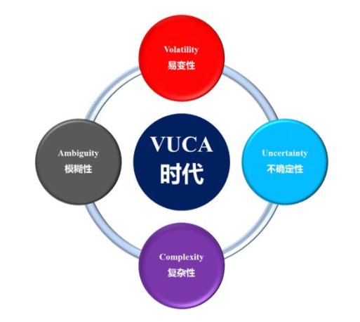

> V=Volatillity（易变性）是变化的本质和动力，也是由变化驱使和催化产生的
>
> U=Uncertainty（不确定性）缺少预见性,缺乏对意外的预期和对事情的理解和意识
>
> C=Complexity（复杂性）企业为各种力量，各种因素，各种事情所困扰。
>
> A=Ambiguity（模糊性）对现实的模糊，是误解的根源，各种条件和因果关系的混杂。

接下来我将从“产品迭代”和“技术革新”两个层面分析介绍如何变化的。

#### **产品迭代**

我们不管是做互联网还是做游戏，其实最终都是在做产品，做一款用户喜欢的产品。乔布斯有句非常著名的名言：“消费者并不知道自己需要什么，直到我们拿出自己的产品，他们才发现，这是我想要的东西”。所以乔帮主能够在一开始的时候就设计好了产品最终的效果，然后按照零部件一步步迭代生产，其步骤可以用下图所示：

全世界只有一个乔布斯，而在我们现实的产品迭代中却是这样的，对话如下：

> 用户：我平时上下班都是走路，每天都要走五公里，好辛苦，有没有办法帮我设计个工具，解决下我的痛点。
>
> 我们思考了下，觉得这个不是很难嘛，可以试下，于是我们讨论 -> 设计 -> 开发 -> 测试 -> 交付给用户了一个**滑板**。
>
> 用户：这个滑板不好操控，可以给我加个扶手吗？
>
> 然后我们按照用户新的需求，生产了个**滑板车**。
>
> 用户：滑板车得滑着走，能不能让我可以骑着走的。
>
> 我们继续改进产品，生产了个**自行车**。
>
> 用户：自行车还得登着走，路程远了也很累。
>
> 我们又继续优化，把它变成了**电瓶车**。
>
> 用户：电瓶车倒是解决了的需求，不过就是不太安全，能再优化下产品吗？
>
> 经过各种努力我们最后生产出了一辆漂亮的**小轿车**交付给了用户，终于让用户满意了。

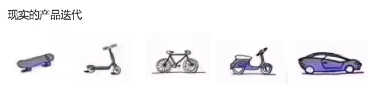

现实中的用户其实一开始并不知道自己想要什么，但是直到看到了我们的产品，他才知道自己不想要什么。

即让现实的产品迭代是如此曲折和反复的，那我们有没有办法快速交付价值、灵活响应变化呢？答案就是DevOps，它是面向业务目标，助力业务成功的最佳实践。

产品的迭代需要DevOps，那么技术的革新更加促进了DevOps的快速发展和落地实施，下面让我们一起看一下技术又是如何支持产品的迭代而不断革新地呢？

#### **技术革新**

在以前的系统中业务单一、逻辑简单、用户量少，项目团队的规模一般在 10~30人。而现在的系统要面对不同用户的定制化推荐等，互联网连接着人与人、人与物、以及物与物，业务也变得越来越复杂，功能越来越多，如果整个系统耦合在一起，则必定会牵一发而动全身，导致系统维护起来相当困难。

因此IT技术架构也随着系统的复杂化而不断地变化革新，从早期所有服务的All In One发展到现在的微服务架构、从纯手动操作到全自动化流程、从单台物理机到云平台，下图展示了IT技术革新的变化：

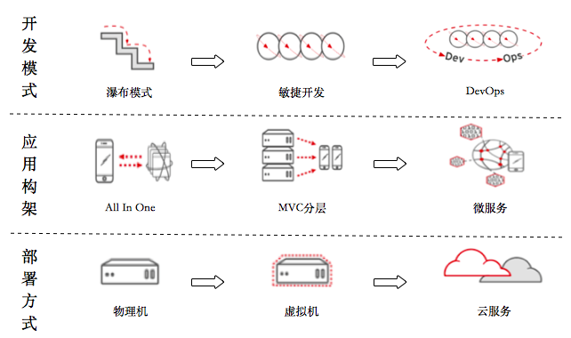

现在DevOps已经成为发展的趋势了，那它又是怎么实现落地的呢？

### 如何实现DevOps的落地

> 知之真切笃实处即是行，行之明觉精察处即是知 —— 明•王守仁《传习录》

在些我引用了圣贤王阳明的一句名言，他提倡“知行合一”，通俗的讲就是做事情要理论与实践相结合。我们在实现DevOps落地时也一定要遵循“理论与实践相结合”的方式进行，理论就是我们做事的指导思想，而实践就是具体做事的方法，接下来我就从我在公司中是如何按照理论与实践相结合来推动DevOps落实地。

#### **落实DevOps的指导思想**

首先我们还是要回到什么是DevOps，如果大家忘记了可以回到之前再温故一下，包括我总结的DevOps公式。

其实DevOps核心思想就是：“快速交付价值，灵活响应变化”。其基本原则如下：

- 高效的协作和沟通；
- 自动化流程和工具；
- 快速敏捷的开发；
- 持续交付和部署；
- 不断学习和创新。

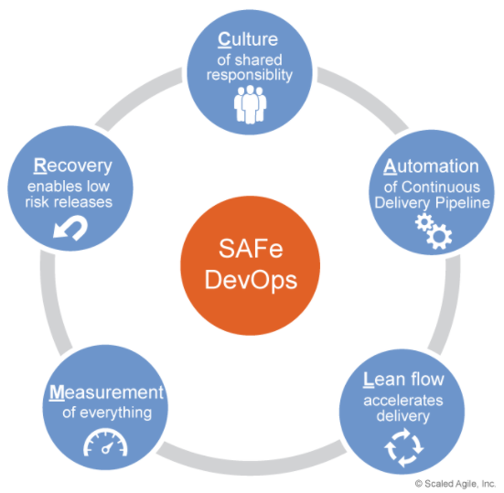

然而这些基本原则又是如何与项目研发息息相关的呢，也就是它们在我们的开发过程中的各个环节是如何体现的？请看下面一张来自《success with enterprise dev-ops - whitepaper》的介绍图：

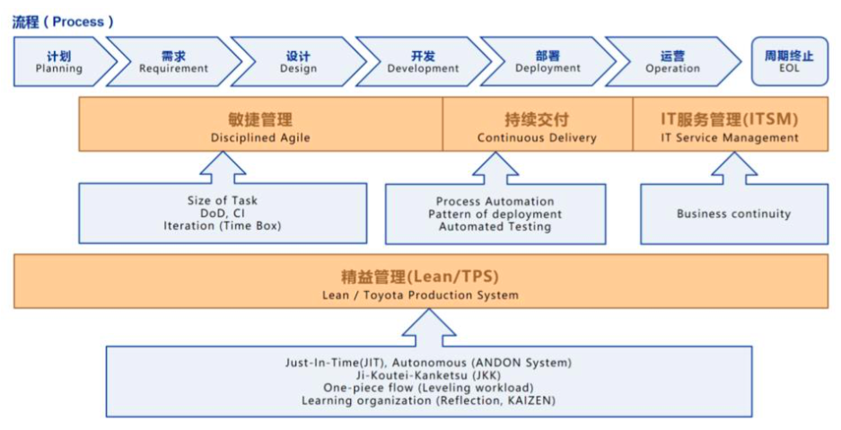

- 敏捷管理：一支训练有素的敏捷开发团队是成功实施DevOps的关键。

  根据**康威定律：软件团队开发的产品是对公司组织架构的反映**。

  所以根据公司情况调整组织结构是首要条件，它将直接影响到需求、设计和开发阶段的效率、以及沟通的成本。

  关于团队的沟通成本在《人月神话》中有个很好的计算公式：沟通成本 = n(n-1)/2，其中n为人数，所以沟通成本将随着组织人员的增加而呈指数级增长。而小而快的敏捷团队如何划分，我将在后面“DevOps的具体实施方法”一节中详细介绍。

- 持续交付部署：实现应用程序的自动化构建、部署、测试和发布。

  通过技术工具，把传统的手工操作转变为自动化流程，这不仅有利于提高产品开发、运维部署的效率，还将减少人为因素引起的失误和事故，提早发现问题并及时地解决问题，这样也保证了产品的质量。下图展示了DevOps自动化的流程：

  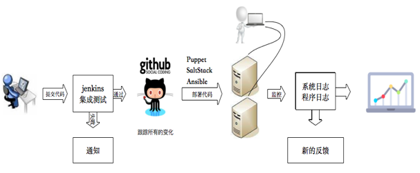

  此图来自我的新书《分布式服务架构：原理、设计与实战》，书中也有具体介绍持续交付部署的细节内容。

- IT服务管理：可持续的、高可用的IT服务是保障业务正常的关键要素，它与业务是一个整体。

  IT服务管理（ITSM）直接影响产品运营的整个生命周期，传统的IT服务管理（像ITIL）在生产中做的非常好了，但是它对于DevOps来说又显得过于繁琐，所以有必要为DevOps创建一个只关注业务持续性的ITMS，它只需要很少的必要资源来为相应的业务提供服务，ITMS更多地从业务角度考虑了。

  > 注：白话解释下什么是IT服务管理（ITSM），它是传统的“IT管理”转向为“IT服务”为主的一种模式，前者可能更关注具体服务器管理、网络管理和系统软件安装部署等工作；而后者更关注流程的规范化、标准化，明确定义各个流程的目标和范围、成本和效益、运营步骤、关键成功因素和绩效指标、有关人员的责权利，以及各个流程之间的关系等，比如建立线上事故解决流程、服务配置管理流程等； 
  > 而光有流程还不够，因为流程主要是IT服务提供方内部使用的，客户对他们并不感兴趣，所以还需将这些流程按需打包成特定的IT服务，然后提供给客户使用，比如在云平台上购买一台虚拟云主机一样。

- 精益管理：建立一个流水线式的IT服务链，打通开发与运维的鸿沟，实现开发运维一体化的敏捷模式。

  精益生产主要来源于丰田生产方式 (TPS)的生产哲学，它以降低浪费、提升整体客户价值而闻名，它主要利用优化自动化流程来提高生产率、降低浪费。所以精益生产的精髓是即时制（JIT）和自动化（Jidoka）。

  > JIT（Just In time）：JIT用一句话描述就是消耗最少的必要资源，以正确的数量，生产和运送正确的零件。在这种模式下工作，可以最大程度上降低库存，防止过早或者过度生产。大多数公司更倾向用库存来避免潜在的停线风险，而丰田却反其道而行之。通过减少库存“逼迫”对生产中产生的问题做及时且有效的反应。当然JIT这一模式对解决问题的能力是相当大的考验，在能力不足的情况下，会有相当大的断线风险。
  >
  > Jidoka（Build in quality）：自动化，日语表示为“自働化”，字面含义是自动化，日语里表示为“自動化”，而在丰田TPS系统里，特意给“動”字加上了“人”字旁变成了“働”，换句话说，TPS/精益生产渴望生产的过程控制能像“人”一样智能，在第一时间就异常情况下自动关闭。这种自动停机功能可以防止坏件流入下游，防止机器在错误的生产状态下造成损坏，也可以让人更好的在当前错误状态下进行故障分析。当设备能够做到自动分析故障时，就可以将监管机器的“人”真正解放出来，做到对人力成本的节省。 
  > ——来自知乎

下图展示了丰田TPS（Toyota Production System）手册中的精益小屋：

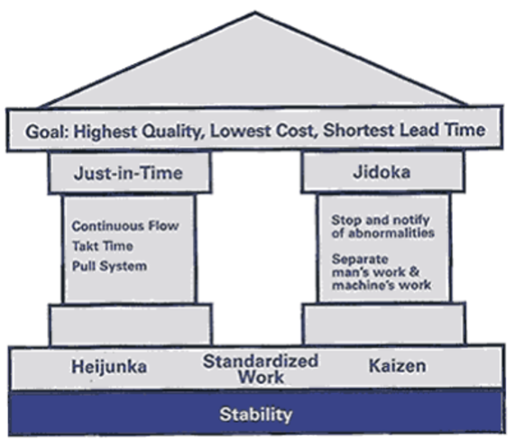

而精益软件开发是精益生产和实践在软件开发领域的应用，总结为如下七条原则：

1. 消除浪费
2. 增强学习
3. 尽量延迟决定
4. 尽快发布
5. 下放权力
6. 嵌入质量
7. 全局优化

精益管理贯穿于整个DevOps阶段，它鼓励主动发现问题，不断的优化流程，从而达到持续交付、快速反馈、降低风险和保障质量的目的。接下来让我们看看DevOps具体的实现方法。

#### **实施DevOps的具体方法**

##### 建立快速敏捷团队

根据之前介绍的康威定律，我们可以看下目前公司中的项目团队结构是怎么的，如下图所示：

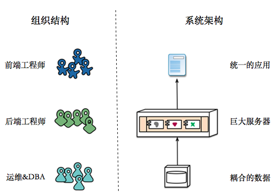

我相信这不仅仅是我们公司这样的结构，而是目前大多数IT互联网公司普遍的分层结构吧，它们一般分为七大部门：产品策划、设计美术、前端工程师、后端工程师、测试工程师、运维&DBA和市场运营等。各部门之间天然的形成了沟通障碍墙，相互之间主要以邮件和会议的形式沟通，效率低下、需求变更困难、很难快速响应市场变化和持续交付高品质的产品。

那么如何调整组织结构，建立一个Scrum团队呢？（什么是Scrum请参考维基百科）

我们会按照业务功能划分团队，建立沟通群组，设置产品负责人（一个策划人员）、Scrum Master（我们一般选择测试人员担任，测试驱动开发模式）和开发者团队（前端工程师、后端工程师、测试各一名），最后的组织结构和系统架构如下图所示：

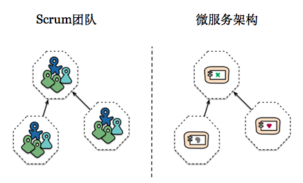

一个高效的敏捷团队是DevOps能落地的保障，那么自动化流程就是保证产品快速交付和持续部署的有效机制，接下来为大家介绍我们是如何实现自动化流程的？

##### 实现自动化的流程

直接看图说话吧，以下为一个完整DevOps的Pipeline：

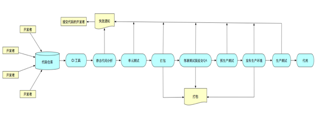

1. 提交：工程师将代码在本地测试后，提交到版本控制系统，如 Git代码仓库中。
2. 构建：持续整合系统（如Jenkins CI），在检测到版本控制系统更新时，便自动从Git代码仓库里拉取最新的代码，进行编译、构建。
3. 单元测试：Jenkins完成编译构建后，会自动执行指定的单元测试代码。
4. 部署到测试环境：在完成单元测试后，Jenkins可以将应用程序部署到与生产环境相近的测试环境中进行测试。
5. 预生产环境测试：在预生产测试环境里，可以进行一些最后的自动化测试，例如使用Appium自动化测试工具进行测试，以及与实际情况类似的一些测试可由开发人员或客户人员手动进行测试。
6. 部署到生产环境：通过所有测试后，便可以使用灰度更新将最新的版本部署到实际生产环境里。

而实现DevOps自动化流水线所需要哪些技术，它们又是如何配合使用的？带着这些问题，我将在DevOps的技术栈一节中详细为大家介绍。接下来让我们看看DevOps在游戏项目中实施所遇到的问题吧。

### DevOps在游戏项目遇到的问题

**问题一：游戏服务很难实现无状态化**

游戏服务架构与互联网架构差别还是很大的，由于游戏对实时性要求较高，所以很多游戏服很难使用分布式集中缓存，从而很难现实游戏服的无状态化，所以在互联网中成熟的微服务解决方案就不能直接应用到游戏中了，我会在后面具体介绍游戏与互联网的对比，以及游戏服如何拆分和解耦的。

**问题二：人手紧缺**

人员紧缺其实是很多公司的普遍问题，然而我经历过的游戏公司中，一个手游项目人员配备通常为：前端5-6人、后端3-4人、测试1-2人和1个运维。所以就很难有专门的人员去负责DevOps的自动化流程实现等了，只能抽空加班由自己推动落实。

**问题三：跨多部门协作，前期沟通培训成本高**

在转型的过程中，由于之前各部门间沟通协作隔着道“墙”，人员知识体系和认知不同，所以团队成员不支持或配合缓慢等。我们可以通过鼓励合作责任共担、建立自动化流程、推倒部门墙、营造DevOps文化奖励积极主动转变的行为、改变风险管理方式建立对失败的宽容环境。

**问题四：前期投入工作量大而见效少**

项目初期人员不足工期又紧的时候，还要做基础设施建设、人员沟通培训等，投入成本高而见效少，很容易让领导层失去信心。所以DevOps的实施也需要分阶段进行，逐步完善流程，以每阶段满足当前业务需求为基本准则，这也正是益精软件的原则。我在工作中一般分为三个时期：产品原型期、产品测试期和产品运营期。（请结合前面自动化流程一节中的“DevOps Pipeline”流水线图看下面三个时期的工作）

- 产品原型期：此时处于开发的前期，所以我们一般只需要实现Git代码仓库、Jenkins CI集成和使用FindBugs或SonarQube执行静态代码分析等。
- 产品测试期：在前面的基础上继续实现Jenkins集成Gradle实现自动构建打包、单元测试、部署到测试环境等流程。
- 产品运营期：最后完善流水线，实现自动部署预生产环境和生产环境，实现灰度更新等。

DevOps的思想先进、理念完美，是目前为止我觉得最好的解决方案，不过DevOps最终能够落地，很大程度上还是归功于它有一整套的技术和开源工具。接下来让我们一起看看DevOps想着的技术栈吧。

## DevOps 技术栈

本节内容如果展开的话涉及太多，我将概略地为大家介绍下目前常见的一些开源DevOps技术工具，大家可以根据自己的需求选择使用，当然也可以使用像VSTS（Visual Studio Team Services）这样的集成团队环境。

其中有些内容在我的新书中有详细介绍，如代码仓库管理、虚拟机与容器化、持续集成&持续部署工具Jenkins、配置管理工具SaltStack。

### 敏捷管理工具

- Trello
- Teambition
- Worktile
- Tower

以上工具使用大同小异，选择一款适合自己团队的就好。我们公司主要使用的是Teambition，截张效果图如下：

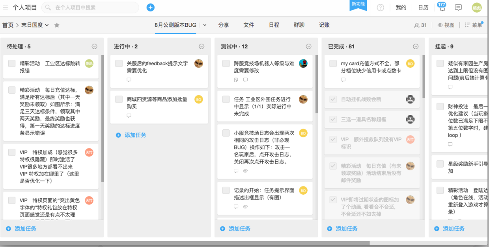

### 产品&质量管理

- confluence
- 禅道
- Jira
- Bugzila

其中confluence和禅道主要是产品的需求、定义、依赖和推广等的全面管理工具；而Jira和Bugzilla是产品的质量管理和监控能力，包括测试用例、缺陷跟踪和质量监控等。目前我们使用Jira较多。

### 代码仓库管理

- Git
- Gitlab
- Github

Git是一个开源的分布式版本控制系统；Gitlab和Github是用于仓库管理系统的开源项目，它们使用Git作为代码管理工具，并在此基础上搭建起来的web服务。我们主要使用的是Git和Gitlab。

### 开发流程规范

- Git Flow

  Git Flow是构建在Git之上的一个组织软件开发活动的模型，是在Git之上构建的一项软件开发最佳实践。Git Flow是一套使用Git进行源代码管理时的一套行为规范和简化部分Git操作的工具。Git Flow模型如下图：

  

- Github Flow

  Github Flow是Git Flow的一个更简单的替换方案，它只有一个feature分支和一个master分支，简单而干净。Github Flow模型如下图：

  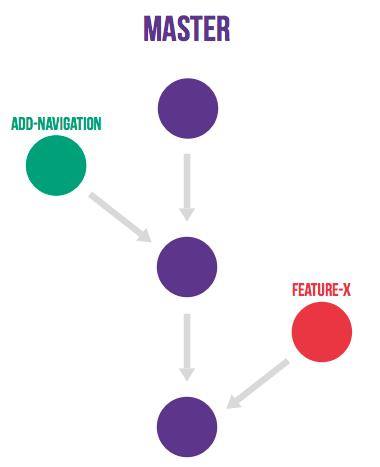

- Gitlab Flow

  GitHub Flow认为你可以通过合并feature分支直接把代码部署到线上。Gitlab Flow模型如下图：

  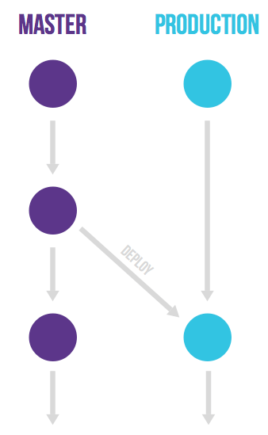

### 自动化构建脚本

- Gradle
- Maven
- SBT
- ANT

我目前主要使用Gradle和Maven，而Gradle是一个基于Apache Ant和Apache Maven概念的项目自动化构建工具。它使用一种基于Groovy的特定领域语言(DSL)来声明项目设置，抛弃了基于XML的各种繁琐配置。面向Java应用为主。当前其支持的语言限于Java、Groovy、Kotlin和Scala。

### 虚拟机与容器化

- VMware
- VirtualBox
- Vagrant
- Docker

VMware和VirtualBox是最常用的虚拟机，支持非常多的平台，而Vagrant是构建在虚拟化技术之上的虚拟机运行环境管理工具。通过Vagrant可以方便实现的对虚拟机的管理，包括建立和删除虚拟机、配置虚拟机运行参数、管理虚拟机运行状态、自动化配置和安装开发环境必须的各类软件、打包和分发虚拟机运行环境等。

Docker是一个开源的应用容器引擎，它让开发者可以打包他们的应用以及依赖包到一个可移植的容器中，然后发布到任何流行的Linux机器上，也可以实现虚拟化。

### 持续集成（CI）&持续部署（CD）

- Jenkins
- Hudson
- Travis CI
- CircleCI

Jenkins是一个开源软件项目，是基于Java开发的一种持续集成工具，用于监控持续重复的工作，旨在提供一个开放易用的软件平台，使软件的持续集成变成可能，它的前身为Hudson。

Travis CI 是目前新兴的开源持续集成构建项目，它与jenkins很明显的区别在于采用yaml格式，简洁清新独树一帜。

CircleCI是一个为web应用开发者提供服务的持续集成平台，主要为开发团队提供测试，持续集成，以及代码部署等服务。

### 自动化测试

- Appium

  Appium是一个移动端的自动化框架，可用于测试原生应用，移动网页应用和混合型应用，且是跨平台的。可用于IOS和Android以及firefox的操作系统。

- Selenium

  Selenium 测试直接在浏览器中运行，就像真实用户所做的一样。Selenium 测试可以在 Windows、Linux 和 Macintosh上的 Internet Explorer、Mozilla 和 Firefox 中运行。

- Mock测试

  Mock测试就是在测试过程中，对于某些不容易构造或者不容易获取的对象，用一个虚拟的对象来创建以便测试的测试方法。这个虚拟的对象就是Mock对象，Mock对象就是真实对象在调试期间的代替品。Java中的Mock框架常用的有EasyMock和Mockito等。

- 消费者驱动契约测试

  契约测试是一种针对外部服务的接口进行的测试，它能够验证服务是否满足消费方期待的契约。当一些消费方通过接口使用某个组件的提供的行为时，它们之间就产生了契约。这个契约包含了对输入和输出的数据结构的期望，性能以及并发性。而PACT是目前比较流的消费者驱动契约测试框架。

### 自动化运维工具

- Ansible
- Puppet
- Chef

IT运维自动化是指将IT运维中日常的、大量的重复性工作自动化，把过去的手工执行转为自动化操作。自动化是IT运维工作的升华，IT运维自动化不单纯是一个维护过程，更是一个管理的提升过程，是IT运维的最高层次，也是未来的发展趋势。下图为常用自动化运维工具对比：

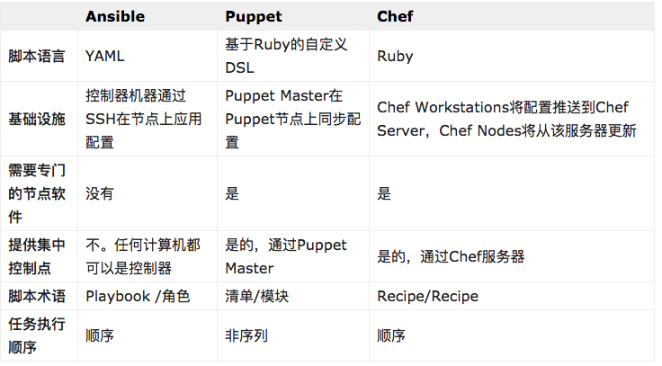

### 监控管理工具

- Zabbix

  Zabbix是一个基于WEB界面的提供分布式系统监视以及网络监视功能的企业级开源解决方案。

- ELK Stack日志分析系统

  ELK Stack是开源日志处理平台解决方案，背后的商业公司是Elastic。它由日志采集解析工具 Logstash、基于 Lucene 的全文搜索引擎 Elasticsearch、分析可视化平台 Kibana三部分组成。

- 云监控（如Amazon CloudWatch）

  Amazon CloudWatch 是一项针对 AWS 云资源和在 AWS 上运行的应用程序进行监控的服务。您可以使用 Amazon CloudWatch 收集和跟踪各项指标、收集和监控日志文件、设置警报以及自动应对 AWS 资源的更改

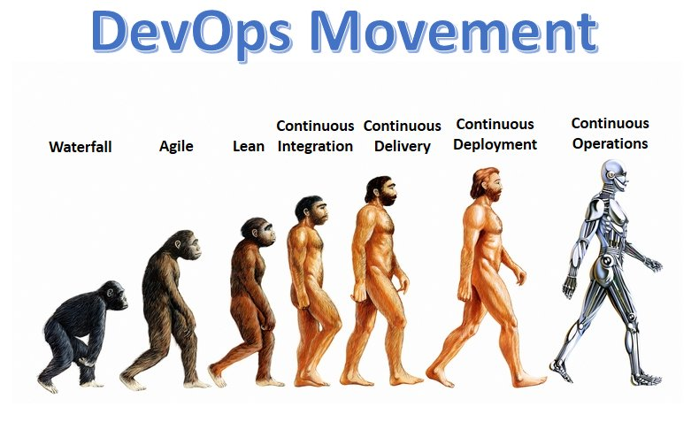

## DevOps自动化

全面自动化 —— 部署、 升级、 扩展、 维护、 数据、 测试、 监测、 安全和策略管理。在自动化方面投入巨资，目标是100%的自动化，不考虑低于90%的可能性。

### DevOps团队工具

| 工具名称   | 工具用途                                     |                       |
| ---------- | -------------------------------------------- | --------------------- |
| Docker     | 虚拟化容器技术，快速构建独立隔离服务         |                       |
| Jenkins    | 自动化平台，可以配置自动化测试与持续部署     |                       |
| New Relic  | 应用性能监测                                 | https://newrelic.com/ |
| Ansible    | 自动化(配置管理工具)平台，持续集成与编排     |                       |
| Kubernetes | 开源的docker编排工具，可以发布与回滚         |                       |
| JMeter     | 基于Java的压力测试工具。用于对软件做压力测试 |                       |

## 游戏架构

### 游戏行业与互联网行业的对比

- 项目迭代周期对比

  互联网的迭代模式

  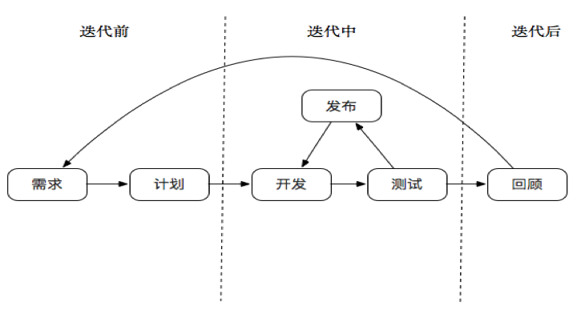

  游戏项目的开发周期

  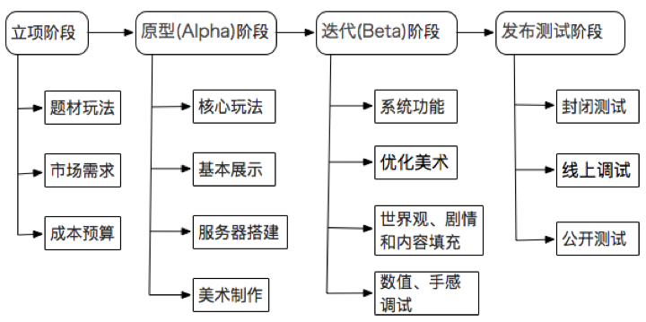

> 通过上面的比对，我们可以看出互联网项目每次的需求迭代可以更敏捷、更快速，因为它可以把大的需求拆分为多个小的具体实现，这样能保证不断地持续交付和部署。
>
> 而游戏相比互联网的迭代就会困难些、时间周期更长些，因为一款游戏能开始交付给用户，最基础的功能和玩法都要完备了才能测试和使用。

- 请求通信机制对比

  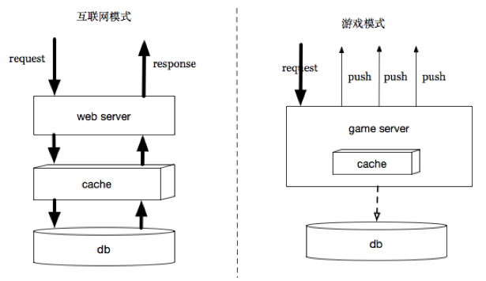

> 互联网中一般为请求-响应模式，通常情况下每次请求都是同步阻塞方式；而游戏中大多为请求-推送模式，不仅推送自己，还推送给游戏中其他的用户，游戏中每次请求都为异步非阻塞方式。

小结：互联网服务器和游戏服务器最大的区别实际上就在于“状态”，游戏服务器的状态是实时快速变化的、可以容忍丢失的、需要大量广播同步的；而互联网服务器的状态一般是持久化的、不容忍丢失的、只和特定客户端相关的。所以在游戏中实现DevOps的难度比互联网大得多，而互联网成熟的实现方案也不能完全的照搬照抄到游戏中来。接下来我将从游戏构架—DevOps实施的源头—来分析介绍常见游戏服务架构是什么样的？

### 常见游戏服务架构分析–DevOps根源

- 休息卡牌游戏

  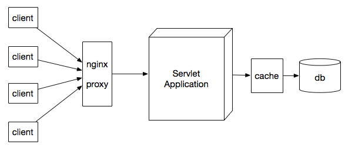

  > 这类游戏一般采用http通信模式，它的架构和常用的web服务器架构差不多，使用redis集中式缓存保存游戏状态，这样就能通过nginx进行负载，游戏服可以支持无限水平扩展。

- 开房间游戏

  

  > 这类型的游戏一般来说服务器端会分为两个部分：一是大厅服务器，一是房间服务器。大厅服务器是一个巨大的广播集群，负责不太实时的数据传输和查询。房间服务器是一组可以快速租用、退还的小型实时广播服务进程。
  >
  > 在大厅服务器中，所有在线的玩家，都按其ID来分布在多个进程中的一个，在玩家之间的查询、广播操作时，采用多个服务器并行操作，最后汇总结果的方式来提供。这样的操作延迟是会比较高，但是能让海量的用户数据存储到不同的机器上；而房间服务器则只负责提供具体的游戏广播功能，一旦玩家组成了群组进入，大厅服务器会拷贝数据到房间服务器，而房间服务器就只对这几个玩家负责了，游戏结束则清理掉这些玩家数据，准备新的游戏。

- 分服游戏

  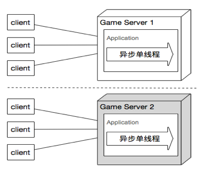

  > 分服模型是游戏服务器中最典型，也是历久最悠久的。其特征是游戏服务器是一个个单独的世界，每个服务器的帐号是独立的，每台服务器用户的状态都是不一样的，一个服就是一个平行的世界，各服之间互不相干。

- 全服模式

  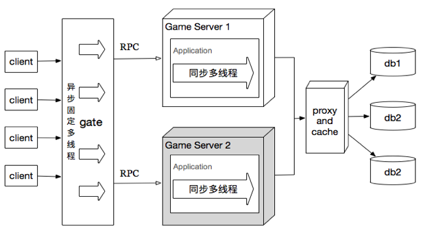

  > 尽管分服的游戏模型已经运营了很多年，但是有一些游戏运营商还是希望能让尽量多的玩家一起玩，因为网游的人气越活跃，产生的交互越多，游戏的乐趣也就越多，所以就要求能开发出满足大量用户在线互动的游戏服务器模型——全服全线模型。
  >
  > SOA架构模式是一个经典的分布式软件架构模式，服务之间使用RPC运程调用功能，而服务的注册和发现则使用ZooKeeper这样的目录服务器。这样游戏服务就拆分为三层结构：最前边的网关（gate）服务器、中间为各游戏服务器（gameServer），最后边的数据库（DB）服务器。这样把网络功能单独提取出来，让用户统一去连接一个网关服务器，再由网关服务器转发数据到后端游戏服务器。而游戏服务器之间数据交换也统一连接到网关服进行交换。所有与DB交互的都连接到DB服务器来代理处理。

小结：现在游戏服务器变得越来越大，不同游戏其实又具有很多相同的功能，所以如何把游戏服务进行拆分解耦，从而实现游戏的服务化就变得相当重要了，接下来我将进一步介绍游戏服务是如何拆分的？

### 游戏服务的解耦–分而治之思想

- 业务层面拆分

  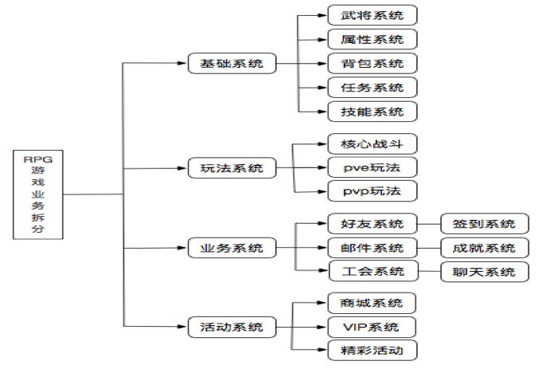

  > 从业务层面，其实所有的RPG游戏都具有武将、属性、背包、任务和技术等五大基础系统，而各游戏的差异化大多在不同的玩法系统，业务系统和活动系统也有很多相似的地方。[板面的做法和配料](http://www.beefsoup.cn/)

- 功能层面拆分

  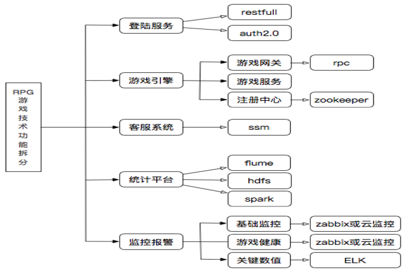

  > 从功能层面，像登陆系统、客服系统、统计系统和监控系统我们也都可以做为通用的游戏服务，提供给各游戏项目使用，从而实现游戏业的SAAS平台。

- 多维度架构

  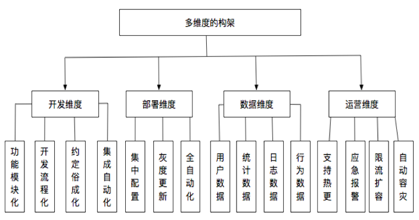

  > 一套游戏平台面向不同的部门和人员，所以也需要从不同的维度考虑和构建，从而尽量满足大部分人的需求和便利。

