## 什么是Docker

Docker是Docker公司开源的一个基于轻量级虚拟化技术的容器引擎项目,整个项目基于Go语言开发，并遵从Apache 2.0协议。目前，Docker可以在容器内部快速自动化部署应用，并可以通过内核虚拟化技术（namespaces及cgroups等）来提供容器的资源隔离与安全保障等。由于Docker通过操作系统层的虚拟化实现隔离，所以Docker容器在运行时，不需要类似虚拟机（VM）额外的操作系统开销，提高资源利用率，并且提升诸如IO等方面的性能。Docker是一个开源的应用容器引擎，使用Go语言开发，基于Linux内核的cgroup，namespace，Union FS等技术，对应用进程进行封装隔离，并且独立于宿主机与其他进程，这种运行时封装的状态称为容器。

Docker 项目的目标是实现轻量级的操作系统虚拟化解决方案。 Docker 的基础是 Linux 容器（LXC）等技术。

在 LXC 的基础上 Docker 进行了进一步的封装，让用户不需要去关心容器的管理，使得操作更为简便。用户操作 Docker 的容器就像操作一个快速轻量级的虚拟机一样简单。
## Docker  VS 传统虚拟化（KVM、XEN等）
下面对比了Docker 和传统虚拟化（KVM、XEN等）方式的不同之处，容器是在操作系统层面上实现虚拟化，直接复用本地主机的操作系统，而传统方式则是在硬件的基础上，虚拟出自己的系统，再在系统上部署相关的APP应用。

|特性 | Docker容器 |虚拟机|
|----|----|----|
| 启动|秒级 |分钟级|
|硬盘使用|一般 MB|一般 GB|
|性能	|接近原生|	弱于|
|系统支持量|	单机支持上千个容器|	一般几十个|
|虚拟化方案|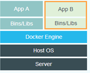	|	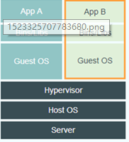|

## 为什么要使用Docker

1. 简化配置
2. 代码流水线（Code Pipeline）管理
3. 提高开发效率
4. 隔离应用
5. 整合服务器
6. 调试能力
7. 多租户环境
8. 快速部署
## Docker架构总览

最核心的是 Docker Daemon我们称之为Docker守护进程，也就是Server端，Server端可以部署在远程，也可以部署在本地，因为Server端与客户端(Docker Client)是通过Rest API进行通信。

docker CLI 实现容器和镜像的管理，为用户提供统一的操作界面,这个 客户端提供一个只读的镜像，然后通过镜像可以创建一个或者多个容器(container)，这些容器可以只是一个RFS(Root File System),也可以是一个包含了用户应用的RFS。容器在docker Client中只是一个进程，两个进程是互不可见的。

用户不能与server直接交互，但可以通过与容器这个桥梁来交互，由于是操作系统级别的虚拟技术，中间的损耗几乎可以不计

**注：**

CLI：command line interface。命令行接口.
RFS：Root File System 根文件系统.  

## Docker 的体系结构

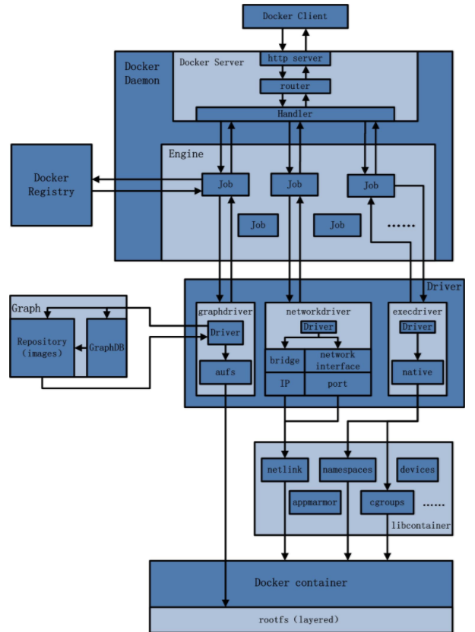

不难看出，用户是使用Docker Client与Docker Daemon建立通信，并发送请求给后者。

而Docker Daemon作为Docker架构中的主体部分，首先提供Server的功能使其可以接受Docker Client的请求；而后Engine执行Docker内部的一系列工作，每一项工作都是以一个Job的形式的存在。

Job的运行过程中，当需要容器镜像时，则从Docker Registry中下载镜像，并通过镜像管理驱动graphdriver将下载镜像以Graph的形式存储；当需要为Docker创建网络环境时，通过网络管理驱动networkdriver创建并配置Docker容器网络环境；当需要限制Docker容器运行资源或执行用户指令等操作时，则通过execdriver来完成。

而libcontainer是一项独立的容器管理包，networkdriver以及execdriver都是通过libcontainer来实现具体对容器进行的操作。

当执行完运行容器的命令后，一个实际的Docker容器就处于运行状态，该容器拥有独立的文件系统，独立并且安全的运行环境等。

## Docker 架构内各模块的功能与实现分析

**主要模块**

5.1    docker client [发起请求]

1. Docker Client是和Docker Daemon建立通信的客户端。用户使用的可执行文件为docker（类似可执行脚本的命令），docker命令后接参数的形式来实现一个完整的请求命令（例如docker images，docker为命令不可变，images为参数可变）。
2. Docker Client可以通过以下三种方式和Docker Daemon建立通信：tcp://host:port，unix://path_to_socket和fd://socketfd。
3. Docker Client发送容器管理请求后，由Docker Daemon接受并处理请求，当Docker Client接收到返回的请求相应并简单处理后，Docker Client一次完整的生命周期就结束了。[一次完整的请求：发送请求→处理请求→返回结果]，与传统的C/S架构请求流程并无不同。

5.2    docker daemon [后台守护进程]

**Docker Daemon架构图**

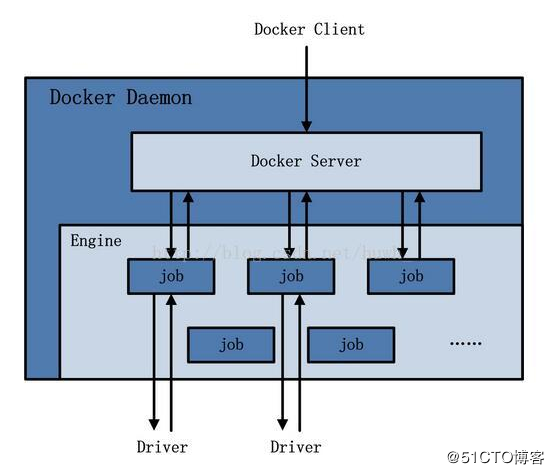

1、Docker Server [调度分发请求]

docker Server 架构图

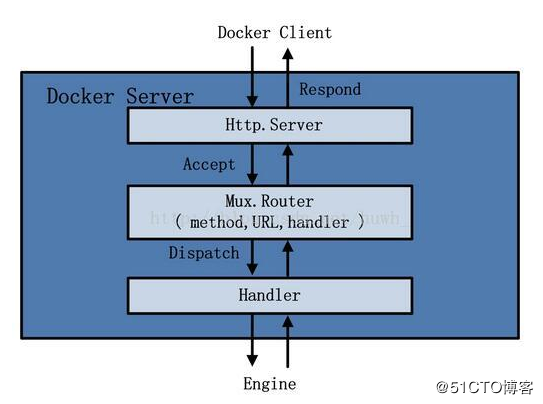

1、Docker Server相当于C/S架构的服务端。功能为接受并调度分发Docker Client发送的请求。接受请求后，Server通过路由与分发调度，找到相应的Handler来执行请求。

2、在Docker的启动过程中，通过包gorilla/mux，创建了一个mux.Router，提供请求的路由功能。在Golang中，gorilla/mux是一个强大的URL路由器以及调度分发器。该mux.Router中添加了众多的路由项，每一个路由项由HTTP请求方法（PUT、POST、GET或DELETE）、URL、Handler三部分组成。

3、创建完mux.Router之后，Docker将Server的监听地址以及mux.Router作为参数，创建一个httpSrv=http.Server{}，最终执行httpSrv.Serve()为请求服务。

4、在Server的服务过程中，Server在listener上接受Docker Client的访问请求，并创建一个全新的goroutine来服务该请求。在goroutine中，首先读取请求内容，然后做解析工作，接着找到相应的路由项，随后调用相应的Handler来处理该请求，最后Handler处理完请求之后回复该请求。

2、Engine

1、Engine是Docker架构中的运行引擎，同时也Docker运行的核心模块。它扮演Docker container存储仓库的角色，并且通过执行job的方式来操纵管理这些容器。

2、在Engine数据结构的设计与实现过程中，有一个handler对象。该handler对象存储的都是关于众多特定job的handler处理访问。举例说明，Engine的handler对象中有一项为：{"create": daemon.ContainerCreate,}，则说明当名为"create"的job在运行时，执行的是daemon.ContainerCreate的handler。

3、Job

1、一个Job可以认为是Docker架构中Engine内部最基本的工作执行单元。Docker可以做的每一项工作，都可以抽象为一个job。例如：在容器内部运行一个进程，这是一个job；创建一个新的容器，这是一个job。Docker Server的运行过程也是一个job，名为serveapi。

2、Job的设计者，把Job设计得与Unix进程相仿。比如说：Job有一个名称，有参数，有环境变量，有标准的输入输出，有错误处理，有返回状态等。

5.3    docker registry [镜像注册中心]

1. Docker Registry是一个存储容器镜像的仓库（注册中心），可理解为云端镜像仓库，按repository来分类，docker pull 按照[repository]:[tag]来精确定义一个image。
2. 在Docker的运行过程中，Docker Daemon会与Docker Registry通信，并实现搜索镜像、下载镜像、上传镜像三个功能，这三个功能对应的job名称分别为"search"，"pull" 与 "push"。
3. 可分为公有仓库（docker hub）和私有仓库。

5.4    Graph [docker内部数据库]

graph的架构图

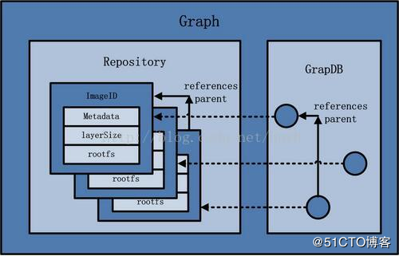

其中，GraphDB是一个构建在SQLite之上的小型图数据库，实现了节点的命名以及节点之间关联关系的记录。它仅仅实现了大多数图数据库所拥有的一个小的子集，但是提供了简单的接口表示节点之间的关系。

同时在Graph的本地目录中，关于每一个的容器镜像，具体存储的信息有：该容器镜像的元数据，容器镜像的大小信息，以及该容器镜像所代表的具体rootfs。

5.5    dirver 

Driver是Docker架构中的驱动模块。通过Driver驱动，Docker可以实现对Docker容器执行环境的定制。即Graph负责镜像的存储，Driver负责容器的执行。在Docker Driver的实现中，可以分为以下三类驱动：graphdriver、networkdriver和execdriver。

**1、graphdriver**

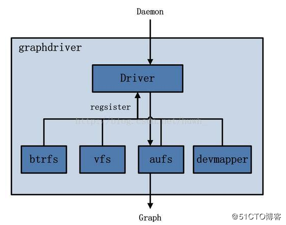

1、graphdriver主要用于完成容器镜像的管理，包括存储与获取。

2、存储：docker pull下载的镜像由graphdriver存储到本地的指定目录（Graph中）。

3、获取：docker run（create）用镜像来创建容器的时候由graphdriver到本地Graph中获取镜像。

**2、networkdriver**

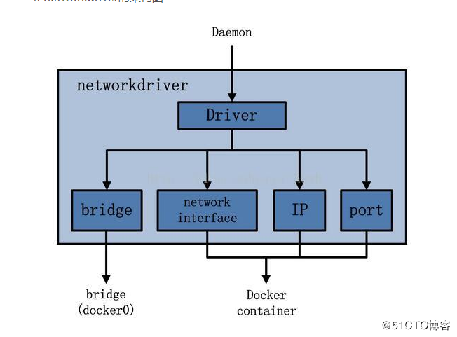

networkdriver的用途是完成Docker容器网络环境的配置，其中包括

- 1、Docker启动时为Docker环境创建网桥；
- 2、Docker容器创建时为其创建专属虚拟网卡设备；
- 3、Docker容器分配IP、端口并与宿主机做端口映射，设置容器防火墙策略等。

**3、execdriver**

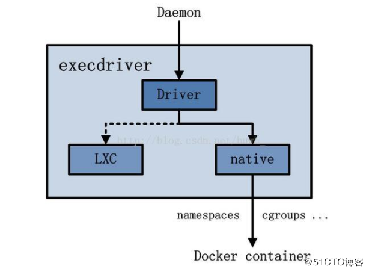

1、execdriver作为Docker容器的执行驱动，负责创建容器运行命名空间，负责容器资源使用的统计与限制，负责容器内部进程的真正运行等。

2、现在execdriver默认使用native驱动，不依赖于LXC。

5.6    libcontainer [函数库]

架构图

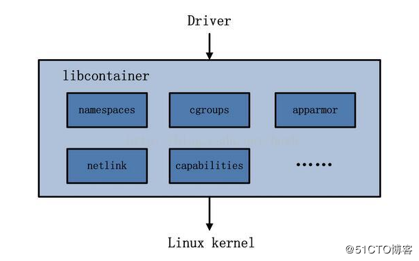

1. libcontainer是Docker架构中一个使用Go语言设计实现的库，设计初衷是希望该库可以不依靠任何依赖，直接访问内核中与容器相关的API。
2. Docker可以直接调用libcontainer，而最终操纵容器的namespace、cgroups、apparmor、网络设备以及防火墙规则等。
3. libcontainer提供了一整套标准的接口来满足上层对容器管理的需求。或者说，libcontainer屏蔽了Docker上层对容器的直接管理。

5.7    docker container[服务交付的最终形式]

container架构图

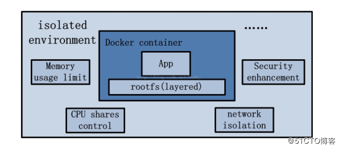

1. Docker container（Docker容器）是Docker架构中服务交付的最终体现形式。

2. Docker按照用户的需求与指令，订制相应的Docker容器：

3. - 用户通过指定容器镜像，使得Docker容器可以自定义rootfs等文件系统；
   - 用户通过指定计算资源的配额，使得Docker容器使用指定的计算资源；
   - 用户通过配置网络及其安全策略，使得Docker容器拥有独立且安全的网络环境；
   - 用户通过指定运行的命令，使得Docker容器执行指定的工作。

## 镜像、容器、仓库

Docker虚拟化有三个概念需要理解，分别镜像、容器、仓库。
镜像：docker的镜像其实就是模板，跟我们常见的ISO镜像类似，是一个样板。
容器：使用镜像常见的应用或者系统，我们称之为一个容器。
仓库：仓库是存放镜像的地方，分为公开仓库（Public）和私有仓库（Private）两种形式.

## Dockerfile、Docker镜像和Docker容器的关系

Dockerfile 是软件的原材料，Docker 镜像是软件的交付品，而 Docker 容器则可以认为是软件的运行态。从应用软件的角度来看，Dockerfile、Docker 镜像与 Docker 容器分别代表软件的三个不同阶段，Dockerfile 面向开发，Docker 镜像成为交付标准，Docker 容器则涉及部署与运维，三者缺一不可，合力充当 Docker 体系的基石。
简单来讲，Dockerfile构建出Docker镜像，通过Docker镜像运行Docker容器。

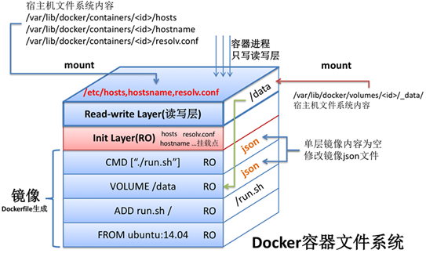

## Docker理念
Docker理念是将应用及依赖包打包到一个可移植的容器中，可发布到任意Linux发行版Docker引擎上。使用沙箱机制运行程序，程序之间相互隔离。

Docker早起版本实现是基于LXC，并进一步对其封装，包括文件系统、网络互联、镜像管理等方面，极大简化了容器管理。从0.7版本以后开始去除LXC，转为自行研发的libcontainer，从1.11版本开始，进一步演进为使用runC和containerd。

Namespaces
命名空间，Linux内核提供的一种对进程资源隔离的机制，例如进程、网络、挂载点等资源。
CGroups
控制组，Linux内核提供的一种限制进程资源的机制；例如CPU、内存等资源。
UnionFS
联合文件系统，支持将不同位置的目录挂载到同一虚拟文件系统，形成一种分层的模型。
Containerd：是一个简单的守护进程，使用runC管理容器。向DockerEngine提供接口。
Shim：只负责管理一个容器。
runC：是一个轻量级的工具，只用来运行容器。

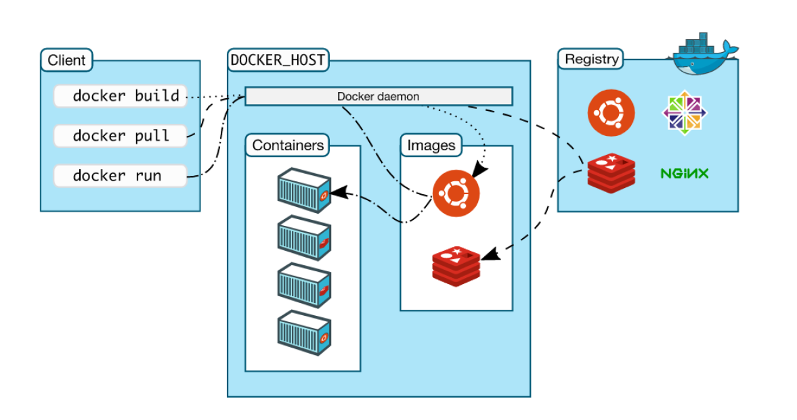

## Docker体系结构

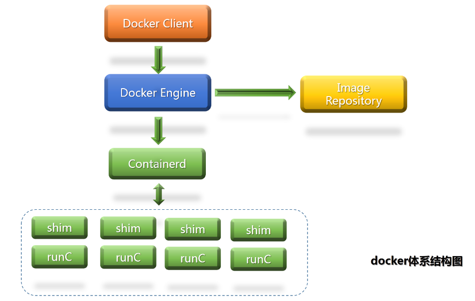

## Docker常用命令

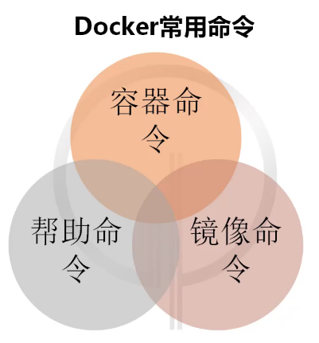

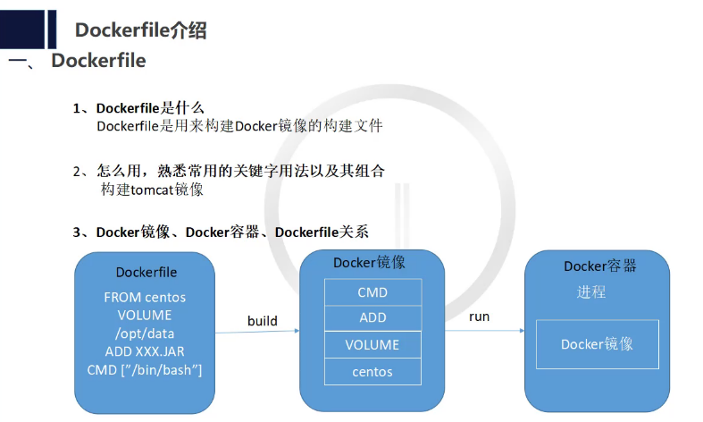