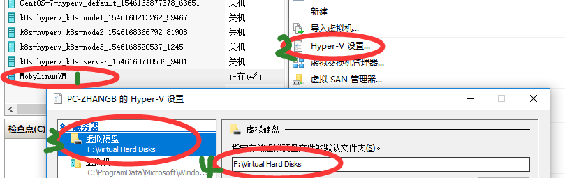
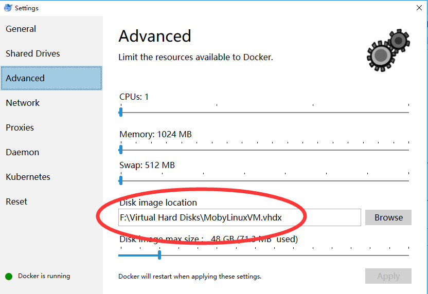

## docker for windows修改虚拟机路径

在windows中使用docker过程中，有时会不会发现系统盘（C盘）空间不够用了？

因为docker for windows在借助hyper-v时，将虚拟机默认存储到了系统盘的此路径中：C:\Users\Public\Documents\Hyper-V\Virtual hard disks\MobyLinuxVM.vhdx，所以会导致C盘空间不够用，

如何修改此路径呢，就是在hyper-v中，直接修改路径即可，见下图：点击 hyper-v设置，修改虚拟机位置即可。
--------------------- 

在hyper-v中修改过路径后，在docker中查看一下，应该也是相同的路径，如下图所示：

## DaoCloud Services 文档

http://guide.daocloud.io/dcs/daocloud-services-9152632.html

{
  "registry-mirrors": [
​    "http://f1361db2.m.daocloud.io"
  ],
  "insecure-registries": [],
  "debug": true,
  "experimental": true
}

docker国内镜像拉取和镜像加速registry-mirrors配置修改