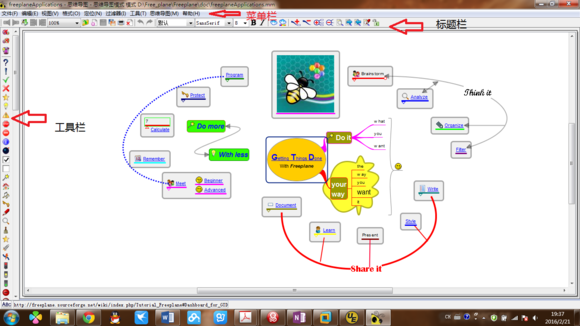
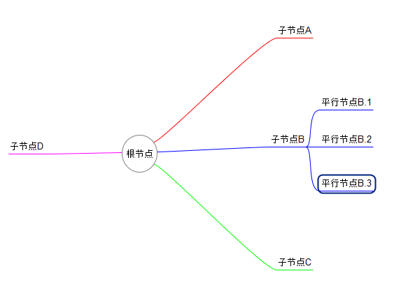
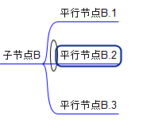
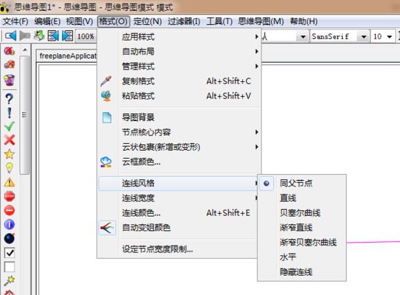

思维导图freemind的使用教程
## 目录结构
一、软件介绍
二、软件安装
三、软件架构
四、导图知识
五、基本操作
六、线上资源

## 软件介绍
Freemind是符合GNU规范的使用java进行编写的开源软件
作用：利用freemind可以简洁、直观的以图景的形式，制作知识点体系图；

## 软件安装
（1）下载安装文件：freemind中文版

（2）安装java环境（jre）

（3）点击Freemind安装包，依次下一步。

## 软件架构：

## 导图知识
导图分为：根节点、子节点、平行节点

## 基本操作
（1）增删改查：
Enter键： 右侧添加子节点
Insert键：添加平行节点
Shift+Enter键； 左侧添加子节点

（2）移动节点

添加完成后，将光标移到节点处，会出现如图的椭圆，拖动该椭圆，使节点到合适的位置；

（3）设置连线样式、颜色：

（4）设置文本格式：

在文本框，右键点击相应的选项；
（5）增加超文本链接
在文本框，右键—>链接—>添加超链接；

## 文件保存、与输出：
点击：文件—>导出—>选择文件类型；

## 文件导入：
点击：文件—>导入—>选择文件（freemind文件的文件名多以“.mm”为后缀）  

## 快捷键

在使用过程中，使用键盘进行各种操作时最快的，鼠标很慢。下面列出常用的快捷键。

| Ctrl+O | 打开文件     | F2            | 编辑节点内容                 |
| ------ | ------------ | ------------- | ---------------------------- |
| Enter  | 插入平行节点 | Ctrl+A        | 全选                         |
| Insert | 插入子节点   | Ctrl+=        | 扩大字体大小                 |
| Ctrl+C | 复制节点     | Ctrl+-        | 缩小字体大小                 |
| Ctrl+X | 剪切节点     | Alt+home      | 收缩节点                     |
| Ctrl+V | 粘贴节点     | Alt+end       | 扩展节点                     |
| Del    | 删除节点     | Ctrl+↑（↓←→） | 上移节点（下移、左移、右移） |
| Alt+↑  | 放大画面     | Alt+↓         | 缩小画面                     |
| Ctrl+I | 斜体         | Ctrl+B        | 粗体                         |

在安装freemind的时侯，需要同时安装java才能正常使用，java下载地址