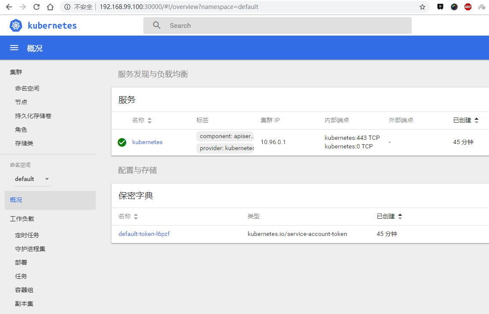

在Windows上学习Docker和Kubernetes，这里使用Minikube安装Kubernetes，minikube是一个运行Docker和Kubernetes的VM。它通常是用来单独运行Kubernetes的，但是你也可以用它来跑Docker容器。

## 前提

### docker安装

```
PS D:\> docker version
Client:
 Version:           18.06.1-ce
 API version:       1.38
 Go version:        go1.10.3
 Git commit:        e68fc7a
 Built:             Tue Aug 21 17:21:34 2018
 OS/Arch:           windows/amd64
 Experimental:      false
error during connect: Get http://%2F%2F.%2Fpipe%2Fdocker_engine/v1.38/version: open //./pipe/docker_engine: The system cannot find the file specified. In the default daemon configuration on Windows, the docker client must be run elevated to connect. This error may also indicate that the docker daemon is not running.
```

### 虚拟机VirtualBox安装

minikube需要在虚拟机中自动创建minikube,创建如图：


## 安装minikube

Minikube是一个最小完整的Kubernetes环境，Minikube的VM可以通过VirtualBox或者Hyper-V来运行（当然也有其他选择）。如果你已经有Hyper-V也要用它来跑Docker和minikube的话就会很方便。当然如果你不能跑Hyper-V也没关系，你可以用VirtualBox实现同样的功能。[更多介绍](https://github.com/kubernetes/minikube)

### 下载kubectl

[下载链接](https://kubernetes.io/docs/tasks/tools/install-kubectl/)

### 下载minikube

[阿里云下载链接](http://kubernetes.oss-cn-hangzhou.aliyuncs.com/minikube/releases/v0.28.0/minikube-windows-amd64.exe?spm=a2c4e.11153940.blogcont221687.28.4ffc7733NjbciY&file=minikube-windows-amd64.exe)，此版本为v0.28.0，会比较快。

将下载的minikube重命名为minikube.exe，然后和kubectl.exe放到一个目录下，比如我这里放在了D:\k8s下，然后配置path路径。

配置完之后，必须以管理员权限打开cmd窗口了，输入命令查看版本，确认是否正常

### minikube版本

minikube version

```
PS D:\> minikube version
minikube version: v0.28.0
```

### kubectl版本

kubectl version

```
PS D:\> kubectl version
Client Version: version.Info{Major:"1", Minor:"10", GitVersion:"v1.10.3", GitCommit:"2bba0127d85d5a46ab4b778548be28623b32d0b0", GitTreeState:"clean", BuildDate:"2018-05-21T09:17:39Z", GoVersion:"go1.9.3", Compiler:"gc", Platform:"windows/amd64"}
Server Version: version.Info{Major:"1", Minor:"10", GitVersion:"v1.10.0", GitCommit:"fc32d2f3698e36b93322a3465f63a14e9f0eaead", GitTreeState:"clean", BuildDate:"2018-03-26T16:44:10Z", GoVersion:"go1.9.3", Compiler:"gc", Platform:"linux/amd64"}
```

## 安装一台单节点的Kubernetes

minikube start

```
PS D:\> minikube start
Starting local Kubernetes v1.10.0 cluster...
Starting VM...
Downloading Minikube ISO
 153.08 MB / 153.08 MB [============================================] 100.00% 0s
Getting VM IP address...
Moving files into cluster...
Setting up certs...
Connecting to cluster...
Setting up kubeconfig...
Starting cluster components...
Kubectl is now configured to use the cluster.
Loading cached images from config file.
```

### 查看上下文

kubectl config view

```
PS D:\> kubectl config view
apiVersion: v1
clusters:
- cluster:
    insecure-skip-tls-verify: true
    server: https://localhost:6445
  name: docker-for-desktop-cluster
- cluster:
    certificate-authority: D:\minikube\.minikube\ca.crt
    server: https://192.168.99.100:8443
  name: minikube
contexts:
- context:
    cluster: docker-for-desktop-cluster
    user: docker-for-desktop
  name: docker-for-desktop
- context:
    cluster: minikube
    user: minikube
  name: minikube
current-context: minikube
kind: Config
preferences: {}
users:
- name: docker-for-desktop
  user:
    client-certificate-data: REDACTED
    client-key-data: REDACTED
- name: minikube
  user:
    client-certificate: D:\minikube\.minikube\client.crt
    client-key: D:\minikube\.minikube\client.key
```

### 查看本地有哪些上下文

kubectl config get-contexts

```
PS D:\> kubectl config get-contexts
CURRENT   NAME                 CLUSTER                      AUTHINFO             NAMESPACE
          docker-for-desktop   docker-for-desktop-cluster   docker-for-desktop
*         minikube             minikube                     minikube
```

### 查看集群情况

kubectl cluster-info

```
PS D:\> kubectl cluster-info
Kubernetes master is running at https://192.168.99.100:8443
KubeDNS is running at https://192.168.99.100:8443/api/v1/namespaces/kube-system/services/kube-dns:dns/proxy

To further debug and diagnose cluster problems, use 'kubectl cluster-info dump'.
```

### 进入到虚拟机

minikube ssh

```
PS D:\> minikube ssh
                         _             _
            _         _ ( )           ( )
  ___ ___  (_)  ___  (_)| |/')  _   _ | |_      __
/' _ ` _ `\| |/' _ `\| || , <  ( ) ( )| '_`\  /'__`\
| ( ) ( ) || || ( ) || || |\`\ | (_) || |_) )(  ___/
(_) (_) (_)(_)(_) (_)(_)(_) (_)`\___/'(_,__/'`\____)

$ docker images
REPOSITORY                                                                          TAG                 IMAGE ID            CREATED             SIZE
registry.cn-hangzhou.aliyuncs.com/google_containers/kube-apiserver-amd64            v1.10.0             af20925d51a3        9 months ago        225MB
registry.cn-hangzhou.aliyuncs.com/google_containers/kube-scheduler-amd64            v1.10.0             704ba848e69a        9 months ago        50.4MB
registry.cn-hangzhou.aliyuncs.com/google_containers/kube-controller-manager-amd64   v1.10.0             ad86dbed1555        9 months ago        148MB
registry.cn-hangzhou.aliyuncs.com/google_containers/etcd-amd64                      3.1.12              52920ad46f5b        10 months ago       193MB
registry.cn-hangzhou.aliyuncs.com/google_containers/kube-addon-manager              v8.6                9c16409588eb        10 months ago       78.4MB
registry.cn-hangzhou.aliyuncs.com/google_containers/pause-amd64                     3.1                 da86e6ba6ca1        12 months ago       742kB
k8s.gcr.io/pause-amd64                                                              3.1                 da86e6ba6ca1        12 months ago       742kB
```

### 访问官方自带的面板

minikube dashboard

```
PS D:\> minikube dashboard
Opening kubernetes dashboard in default browser...
```

这里会自动打开一个链接：
http://192.168.99.100:30000
