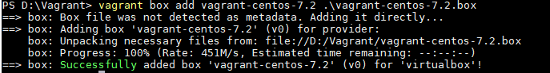
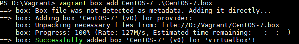
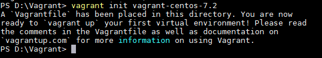
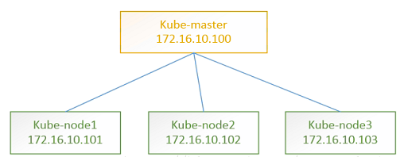

## 

## 参考
https://www.vagrantup.com/intro/index.html
https://blog.csdn.net/rickiyeat/article/details/55097687
https://github.com/astaxie/go-best-practice/blob/master/ebook/zh/01.0.md

## Vagrant 安装
到官方网站下载相应系统平台的安装包：http://www.vagrantup.com/downloads.html
直接根据向导进行操作即可完成安装，安装完后就可以在终端输入 vagrant 命令了。

## Vagrant 启动第一台虚拟机
到此准备工作（VirtualBox 和 Vagrant 安装）基本上做完了，接下来就可以通过 Vagrant 来启动一台虚拟机了。

## Vagrant box
下载
http://www.vagrantbox.es/

在启动虚拟机之前先简单介绍下 Vagrant box：box 是一个打包好的操作系统，是一个后缀名为 .box 的文件，其实是一个压缩包，里面包含了 Vagrant 的配置信息和 VirtualBox 的虚拟机镜像文件。vagrant up 启动虚拟机是基于 box 文件的，因此在启动虚拟机前必须得把 box 文件准备好。或者也可以在启动的时候指定远程 box 地址，在这里我把 box 文件下载下来，然后启动时指定该文件。
vagrant-centos-7.2.box
我使用网上分享的 ubuntu-server-16.04 这个 box，由于vagrant 官方 box 下载速度特别慢，所以在此提供一下该 box 的百度网盘下载地址，加速下载：https://pan.baidu.com/s/1wJCeWEyxKQLVPi1IH1IlYg
1. 新建一个目录作为 Vagrant 的工程目录

2. 添加前面下载的 box
     添加 box 命令格式：vagrant box add <本地 box 名称> <box 文件>
       本地 box 名称：自定义名称，该名称是本地 vagrant 管理时使用的名称；
       box 文件：前面下载的 vagrant box 文件或者远程 box url 地址；
        vagrant box add vagrant-centos-7.2 .\vagrant-centos-7.2.box

     

 


5. 查看 box 是否添加成功
     查看当前 vagrant 中有哪些 box：
     vagrant box list
     

4.初始化上面添加的 box
初始化命令格式：vagrant init <本地 box 名称>
本地 box 名称：第 2 步中添加的 box 名称
这里初始化前面添加的 box，初始化后会在当前目录生产一个 Vagrantfile 文件，里面包含了虚拟机的各种配置，关于具体每个配置项是什么意思，后面会介绍。

vagrant init vagrant-centos-7.2


5.启动虚拟机
虚拟机启动命令：vagrant up
启动虚拟机时会自动将当前目录（即 Vagrantfile 文件所在目录），和虚拟机的 /vagrant 目录共享。
vagrant up

6.连接虚拟机

在windows10上面使用vagrant将网上的box生成了虚拟机，当然中间使用了virtualbox作为中间工具，有以下几种登录方式。

- 使用xshell登陆虚拟机，用户名：vagrant ，密   码：vagrant ，root帐号密码：vagrant
- 使用xshell登陆虚拟机，直接配置private_key
- SSH登录虚拟机
  在`vagrant ssh`和直接`ssh`的时候，我们都使用了vagrant提供的不安全的密钥`/private_key`，D:\Vagrant\.vagrant\machines\default\virtualbox\private_key

7.查看 Vagrant 共享目录
进入虚拟机后执行 df -h 可以看到 Vagrant 默认把宿主机 Vagrantfile 所在的目录和虚拟机的 /vagrant 目录共享，可以通过 ls /vagrant/ 查看该目录内容，内容和宿主机对应目录一致。

ubuntu@ubuntu-xenial:~$ df -h
Filesystem      Size  Used Avail Use% Mounted on
udev            490M     0  490M   0% /dev
tmpfs           100M  3.1M   97M   4% /run
/dev/sda1       9.7G  857M  8.8G   9% /
tmpfs           497M     0  497M   0% /dev/shm
tmpfs           5.0M     0  5.0M   0% /run/lock
tmpfs           497M     0  497M   0% /sys/fs/cgroup
vagrant         234G   49G  185G  21% /vagrant
tmpfs           100M     0  100M   0% /run/user/1000

### 终止虚拟机

运行 vagrant destroy
`vagrant destroy` 命令实际上并不删除下载的 box 文件。


ls 查看该共享目录内容和宿主机内容一致

ubuntu@ubuntu-xenial:~$ ls /vagrant/
ubuntu-xenial-16.04-cloudimg-console.log  Vagrantfile
---------------------


## Vagrant 常用命令清单
vagrant box add 添加box
vagrant init 初始化 box
vagrant up 启动虚拟机
vagrant ssh 登录虚拟机
vagrant box list 列出 Vagrant 当前 box 列表
vagrant box remove 删除相应的 box
vagrant destroy 停止当前正在运行的虚拟机并销毁所有创建的资源
vagrant halt 关机
vagrant package 把当前的运行的虚拟机环境进行打包为 box 文件
vagrant plugin 安装卸载插件
vagrant reload 重新启动虚拟机，重新载入配置文件
vagrant resume 恢复被挂起的状态
vagrant status 获取当前虚拟机的状态
vagrant suspend 挂起当前的虚拟机
vagrant global-status 查看当前 vagrant 管理的所有 vm 信息
vagrant ssh-config 输出用于 ssh 连接的一些信息

## Vagrant 启动虚拟机集群
前面我们都是通过一个 Vagrantfile 配置启动单台机器，如果我们要启动一个集群，那么可以把需要的节点在一个 Vagrantfile 写好，然后直接就可以通过 vagrant up 同时启动多个 VM 组成一个集群。以下示例配置一个 web 节点和一个 db 节点，两个节点在同一个网段，并且使用同一个 box 启动。

### 使用Vagrant快速部署出一套Kubernetes的多节点模拟测试环境

安装virtualbox与Vagrant的部分略过。

1）测试环境的架构及地址信息
我们将要实现快速部署的这套k8s环境结构和网络地址信息如下图所示。虽然这里是提供了3个node节点，而实际上只需要改动Vagrantfile中的一个参数，就可以根据需要随意决定创建出几个node节点来。



2）负责自动生成4个Centos7.5的测试机的Vagrantfile文件
我们看一下生成这套模拟测试环境使用的Vagrantfile文件：

    # -*- mode: ruby -*-
    # vi: set ft=ruby :
    Vagrant.configure("2") do |config|
      config.vm.box = "boxes/centos-7.5"
      config.vm.box_check_update = false
      config.vm.provider "virtualbox"
    
      $num_vms = 3
      (1..$num_vms).each do |id|
       config.vm.define "kube-node#{id}" do |node|
         node.vm.hostname = "kube-node#{id}"
         node.vm.network :private_network, ip: "172.16.10.10#{id}",  auto_config: true
         node.vm.provider :virtualbox do |vb, override|
           vb.name = "kube-node#{id}"
           vb.gui = false
           vb.memory = 1024
           vb.cpus = 1
         end
       end
      end
      config.vm.define "kube-server" do |node|
       node.vm.hostname = "kube-server"
       node.vm.network :private_network, ip: "172.16.10.100",  auto_config: true
       config.vm.network "forwarded_port", guest: 8080, host: 8080 # kube-apiserver
       config.vm.network "forwarded_port", guest: 8086, host: 8086 # kubectl proxy
       config.vm.network "forwarded_port", guest: 443, host: 4443 # harbor
       node.vm.provider :virtualbox do |vb, override|
         vb.name = "kube-server"
         vb.gui = false
         vb.memory = 1024
         vb.cpus = 1
       end
      end
    end
从上面文件中我们可以看到，先是定义了一个kube-server，而且把配置了几个宿主机到虚机的转发端口，这样我们就可以从虚机外部访问到它里面的服务了。
然后是通过一个循环，创建出3个kube-node节点，均指定了定制的主机名和ip地址。

3）准备一下运行该Vagrantfile所需要的资源环境
大概需要准备好以下三个环境资源：
在自己PC机上创建一个目录，把上面的Vagrantfile文件放入其中。
在该目录中再创建一个存放box镜像文件的子目录：boxes
最后是找到一个可用的virtualbox镜像文件并导入到Vagrant中
我们这里是使用的自制的centos-7.5.virtualbox.box镜像box文件。
先把centos-7.5.virtualbox.box文件放入到boxes目录中；
使用vagrant box add命令导入；
查看导入后的结果；

$ 	vagrant  box  add  boxes/centos-7.5 file:///F:/Vagrant/boxes/centos-7.5.virtualbox.box

==> box: Box file was not detected as metadata. Adding it directly...
==> box: Adding box 'boxes/centos-7.5' (v0) for provider:
​    box: Unpacking necessary files from: file:///d:/soft/k8s-vagrant-demo/boxes/
centos-7.5.virtualbox.box
​    box: Progress: 100% (Rate: 109M/s, Estimated time remaining: --:--:--)
==> box: Successfully added box 'boxes/centos-7.5' (v0) for 'virtualbox'!

D:\soft\k8s-vagrant-demo>vagrant box list
boxes/centos-7.5 (virtualbox, 0)
D:\soft\k8s-vagrant-demo>

上面使用的centos-7.5.virtualbox.box文件，已经放在了网盘中一份，供需要的人使用。
https://pan.baidu.com/s/17l69evRtpxdAJMTdtsGf8w

不过您也可以根据自己的需要，自行制作box文件。
关于怎么制作box镜像，有很多种方法，目前来讲最为便捷的应该是使用packer，结合github上共享出来的创建Vagrant box的模板文件，几乎不需要自己做太多事情。
以下为两个关键链接，供参考。
https://www.packer.io/downloads.html
https://github.com/boxcutter/centos

使用packer制作一个Vagrant box，需要安装packer工具，找一个自己适用的json模板，执行packer build命令就可以等着自动安装完成并输出box文件了。
$ cd centos
$ packer build -except=parallels-iso,vmware-iso centos-7.5-x86_64.json

4）启动Vagrant测试环境
打开一个命令行终端容器，进入刚才存放了Vagrantfile文件的目录；
执行vagrant up命令，等待5~10分钟（视你的电脑性能而定）；

```
D:\soft\k8s-vagrant-demo>vagrant up

PS F:\RepoSpaces\public\github\demo-maven\demo-vagrant> vagrant up
Bringing machine 'k8s-node1' up with 'virtualbox' provider...
Bringing machine 'k8s-node2' up with 'virtualbox' provider...
Bringing machine 'k8s-node3' up with 'virtualbox' provider...
Bringing machine 'k8s-server' up with 'virtualbox' provider...
==> k8s-node1: Clearing any previously set network interfaces...
==> k8s-node1: Preparing network interfaces based on configuration...
​    k8s-node1: Adapter 1: nat
​    k8s-node1: Adapter 2: hostonly
==> k8s-node1: Forwarding ports...
​    k8s-node1: 22 (guest) => 2222 (host) (adapter 1)
==> k8s-node1: Running 'pre-boot' VM customizations...
==> k8s-node1: Booting VM...
==> k8s-node1: Waiting for machine to boot. This may take a few minutes...
​    k8s-node1: SSH address: 127.0.0.1:2222
​    k8s-node1: SSH username: vagrant
​    k8s-node1: SSH auth method: private key
​    k8s-node1: Warning: Connection reset. Retrying...
​    k8s-node1: Warning: Connection aborted. Retrying...
​    k8s-node1: Warning: Remote connection disconnect. Retrying...
​    k8s-node1: Warning: Connection reset. Retrying...
​    k8s-node1: Warning: Connection aborted. Retrying...
​    k8s-node1: Warning: Connection reset. Retrying...
​    k8s-node1: Warning: Connection aborted. Retrying...
​    k8s-node1:
​    k8s-node1: Vagrant insecure key detected. Vagrant will automatically replace
​    k8s-node1: this with a newly generated keypair for better security.
​    k8s-node1:
​    k8s-node1: Inserting generated public key within guest...
​    k8s-node1: Removing insecure key from the guest if it's present...
​    k8s-node1: Key inserted! Disconnecting and reconnecting using new SSH key...
==> k8s-node1: Machine booted and ready!
==> k8s-node1: Checking for guest additions in VM...
​    k8s-node1: The guest additions on this VM do not match the installed version of
​    k8s-node1: VirtualBox! In most cases this is fine, but in rare cases it can
​    k8s-node1: prevent things such as shared folders from working properly. If you see
​    k8s-node1: shared folder errors, please make sure the guest additions within the
​    k8s-node1: virtual machine match the version of VirtualBox you have installed on
​    k8s-node1: your host and reload your VM.
​    k8s-node1:
​    k8s-node1: Guest Additions Version: 5.1.18
​    k8s-node1: VirtualBox Version: 6.0
==> k8s-node1: Setting hostname...
==> k8s-node1: Configuring and enabling network interfaces...
==> k8s-node1: Mounting shared folders...
​    k8s-node1: /vagrant => F:/RepoSpaces/public/github/demo-maven/demo-vagrant
==> k8s-node2: Importing base box 'boxes/centos-7.5'...
==> k8s-node2: Matching MAC address for NAT networking...
==> k8s-node2: Setting the name of the VM: k8s-node2
==> k8s-node2: Fixed port collision for 22 => 2222. Now on port 2200.
==> k8s-node2: Clearing any previously set network interfaces...
==> k8s-node2: Preparing network interfaces based on configuration...
​    k8s-node2: Adapter 1: nat
​    k8s-node2: Adapter 2: hostonly
==> k8s-node2: Forwarding ports...
​    k8s-node2: 22 (guest) => 2200 (host) (adapter 1)
==> k8s-node2: Running 'pre-boot' VM customizations...
==> k8s-node2: Booting VM...
==> k8s-node2: Waiting for machine to boot. This may take a few minutes...
​    k8s-node2: SSH address: 127.0.0.1:2200
​    k8s-node2: SSH username: vagrant
​    k8s-node2: SSH auth method: private key
​    k8s-node2: Warning: Connection reset. Retrying...
​    k8s-node2: Warning: Connection aborted. Retrying...
​    k8s-node2: Warning: Remote connection disconnect. Retrying...
​    k8s-node2: Warning: Connection reset. Retrying...
​    k8s-node2: Warning: Connection aborted. Retrying...
​    k8s-node2: Warning: Connection aborted. Retrying...
​    k8s-node2: Warning: Connection reset. Retrying...
​    k8s-node2: Warning: Remote connection disconnect. Retrying...
​    k8s-node2:
​    k8s-node2: Vagrant insecure key detected. Vagrant will automatically replace
​    k8s-node2: this with a newly generated keypair for better security.
​    k8s-node2:
​    k8s-node2: Inserting generated public key within guest...
​    k8s-node2: Removing insecure key from the guest if it's present...
​    k8s-node2: Key inserted! Disconnecting and reconnecting using new SSH key...
==> k8s-node2: Machine booted and ready!
==> k8s-node2: Checking for guest additions in VM...
​    k8s-node2: The guest additions on this VM do not match the installed version of
​    k8s-node2: VirtualBox! In most cases this is fine, but in rare cases it can
​    k8s-node2: prevent things such as shared folders from working properly. If you see
​    k8s-node2: shared folder errors, please make sure the guest additions within the
​    k8s-node2: virtual machine match the version of VirtualBox you have installed on
​    k8s-node2: your host and reload your VM.
​    k8s-node2:
​    k8s-node2: Guest Additions Version: 5.1.18
​    k8s-node2: VirtualBox Version: 6.0
==> k8s-node2: Setting hostname...
==> k8s-node2: Configuring and enabling network interfaces...
==> k8s-node2: Mounting shared folders...
​    k8s-node2: /vagrant => F:/RepoSpaces/public/github/demo-maven/demo-vagrant
==> k8s-node3: Importing base box 'boxes/centos-7.5'...
==> k8s-node3: Matching MAC address for NAT networking...
==> k8s-node3: Setting the name of the VM: k8s-node3
==> k8s-node3: Fixed port collision for 22 => 2222. Now on port 2201.
==> k8s-node3: Clearing any previously set network interfaces...
==> k8s-node3: Preparing network interfaces based on configuration...
​    k8s-node3: Adapter 1: nat
​    k8s-node3: Adapter 2: hostonly
==> k8s-node3: Forwarding ports...
​    k8s-node3: 22 (guest) => 2201 (host) (adapter 1)
==> k8s-node3: Running 'pre-boot' VM customizations...
==> k8s-node3: Booting VM...
==> k8s-node3: Waiting for machine to boot. This may take a few minutes...
​    k8s-node3: SSH address: 127.0.0.1:2201
​    k8s-node3: SSH username: vagrant
​    k8s-node3: SSH auth method: private key
​    k8s-node3: Warning: Connection reset. Retrying...
​    k8s-node3: Warning: Connection aborted. Retrying...
​    k8s-node3: Warning: Remote connection disconnect. Retrying...
​    k8s-node3: Warning: Connection aborted. Retrying...
​    k8s-node3: Warning: Connection reset. Retrying...
​    k8s-node3: Warning: Remote connection disconnect. Retrying...
​    k8s-node3: Warning: Connection aborted. Retrying...
​    k8s-node3: Warning: Connection reset. Retrying...
​    k8s-node3:
​    k8s-node3: Vagrant insecure key detected. Vagrant will automatically replace
​    k8s-node3: this with a newly generated keypair for better security.
​    k8s-node3:
​    k8s-node3: Inserting generated public key within guest...
​    k8s-node3: Removing insecure key from the guest if it's present...
​    k8s-node3: Key inserted! Disconnecting and reconnecting using new SSH key...
==> k8s-node3: Machine booted and ready!
==> k8s-node3: Checking for guest additions in VM...
​    k8s-node3: The guest additions on this VM do not match the installed version of
​    k8s-node3: VirtualBox! In most cases this is fine, but in rare cases it can
​    k8s-node3: prevent things such as shared folders from working properly. If you see
​    k8s-node3: shared folder errors, please make sure the guest additions within the
​    k8s-node3: virtual machine match the version of VirtualBox you have installed on
​    k8s-node3: your host and reload your VM.
​    k8s-node3:
​    k8s-node3: Guest Additions Version: 5.1.18
​    k8s-node3: VirtualBox Version: 6.0
==> k8s-node3: Setting hostname...
==> k8s-node3: Configuring and enabling network interfaces...
==> k8s-node3: Mounting shared folders...
​    k8s-node3: /vagrant => F:/RepoSpaces/public/github/demo-maven/demo-vagrant
==> k8s-server: Importing base box 'boxes/centos-7.5'...
==> k8s-server: Matching MAC address for NAT networking...
==> k8s-server: Setting the name of the VM: k8s-server
==> k8s-server: Fixed port collision for 22 => 2222. Now on port 2202.
==> k8s-server: Clearing any previously set network interfaces...
==> k8s-server: Preparing network interfaces based on configuration...
​    k8s-server: Adapter 1: nat
​    k8s-server: Adapter 2: hostonly
==> k8s-server: Forwarding ports...
​    k8s-server: 8080 (guest) => 8080 (host) (adapter 1)
​    k8s-server: 8086 (guest) => 8086 (host) (adapter 1)
​    k8s-server: 443 (guest) => 4443 (host) (adapter 1)
​    k8s-server: 22 (guest) => 2202 (host) (adapter 1)
==> k8s-server: Running 'pre-boot' VM customizations...
==> k8s-server: Booting VM...
==> k8s-server: Waiting for machine to boot. This may take a few minutes...
​    k8s-server: SSH address: 127.0.0.1:2202
​    k8s-server: SSH username: vagrant
​    k8s-server: SSH auth method: private key
​    k8s-server: Warning: Connection reset. Retrying...
​    k8s-server: Warning: Connection aborted. Retrying...
​    k8s-server: Warning: Remote connection disconnect. Retrying...
​    k8s-server: Warning: Connection aborted. Retrying...
​    k8s-server: Warning: Connection reset. Retrying...
​    k8s-server: Warning: Remote connection disconnect. Retrying...
​    k8s-server: Warning: Connection aborted. Retrying...
​    k8s-server: Warning: Connection reset. Retrying...
​    k8s-server: Warning: Remote connection disconnect. Retrying...
​    k8s-server:
​    k8s-server: Vagrant insecure key detected. Vagrant will automatically replace
​    k8s-server: this with a newly generated keypair for better security.
​    k8s-server:
​    k8s-server: Inserting generated public key within guest...
​    k8s-server: Removing insecure key from the guest if it's present...
​    k8s-server: Key inserted! Disconnecting and reconnecting using new SSH key...
==> k8s-server: Machine booted and ready!
==> k8s-server: Checking for guest additions in VM...
​    k8s-server: The guest additions on this VM do not match the installed version of
​    k8s-server: VirtualBox! In most cases this is fine, but in rare cases it can
​    k8s-server: prevent things such as shared folders from working properly. If you see
​    k8s-server: shared folder errors, please make sure the guest additions within the
​    k8s-server: virtual machine match the version of VirtualBox you have installed on
​    k8s-server: your host and reload your VM.
​    k8s-server:
​    k8s-server: Guest Additions Version: 5.1.18
​    k8s-server: VirtualBox Version: 6.0
==> k8s-server: Setting hostname...
==> k8s-server: Configuring and enabling network interfaces...
==> k8s-server: Mounting shared folders...
​    k8s-server: /vagrant => F:/RepoSpaces/public/github/demo-maven/demo-vagrant

```

查看Vagrant虚机列表：

```
PS F:\RepoSpaces\public\github\demo-maven\demo-vagrant> vagrant status
Current machine states:

k8s-node1                 running (virtualbox)
k8s-node2                 running (virtualbox)
k8s-node3                 running (virtualbox)
k8s-server                running (virtualbox)

This environment represents multiple VMs. The VMs are all listed
above with their current state. For more information about a specific
VM, run `vagrant status NAME`.
```

​	

登录到kube-server虚机中：
D:\soft\k8s-vagrant-demo>vagrant ssh kube-server
[vagrant@kube-server ~]$
[vagrant@kube-server ~]$ ip a
1: lo: <LOOPBACK,UP,LOWER_UP> mtu 65536 qdisc noqueue state UNKNOWN group default qlen 1000
​    link/loopback 00:00:00:00:00:00 brd 00:00:00:00:00:00
​    inet 127.0.0.1/8 scope host lo
​       valid_lft forever preferred_lft forever
​    inet6 ::1/128 scope host
​       valid_lft forever preferred_lft forever
2: enp0s3: <BROADCAST,MULTICAST,UP,LOWER_UP> mtu 1500 qdisc pfifo_fast state UP group default qlen 1000
​    link/ether 08:00:27:39:53:60 brd ff:ff:ff:ff:ff:ff
​    inet 10.0.2.15/24 brd 10.0.2.255 scope global noprefixroute dynamic enp0s3
​       valid_lft 86115sec preferred_lft 86115sec
​    inet6 fe80::56a6:ce35:5951:f6d8/64 scope link noprefixroute
​       valid_lft forever preferred_lft forever
3: enp0s8: <BROADCAST,MULTICAST,UP,LOWER_UP> mtu 1500 qdisc pfifo_fast state UP group default qlen 1000
​    link/ether 08:00:27:8c:ef:53 brd ff:ff:ff:ff:ff:ff
​    inet 172.16.10.100/24 brd 172.16.10.255 scope global noprefixroute enp0s8
​       valid_lft forever preferred_lft forever
​    inet6 fe80::a00:27ff:fe8c:ef53/64 scope link
​       valid_lft forever preferred_lft forever
[vagrant@kube-server ~]$

[vagrant@kube-server ~]$ ip r
default via 10.0.2.2 dev enp0s3 proto dhcp metric 100
10.0.2.0/24 dev enp0s3 proto kernel scope link src 10.0.2.15 metric 100
172.16.10.0/24 dev enp0s8 proto kernel scope link src 172.16.10.100 metric 101

至此，这套4节点的k8s测试环境基础设施我们就搭建完成了。在这个环境上，我们可以方便得部署和验证软件功能。关闭环境执行vagrant halt，销毁环境执行vagrant destroy。无论是执行的halt还是destroy，一旦执行了vagrant up后，都会让你重新运行起来这套测试环境。区别仅在于destroy后，再创建出来的是一个回来起点时的环境了。

作者：运维个西瓜 
来源：CSDN 
原文：https://blog.csdn.net/watermelonbig/article/details/80796264 
版权声明：本文为博主原创文章，转载请附上博文链接！

```

```