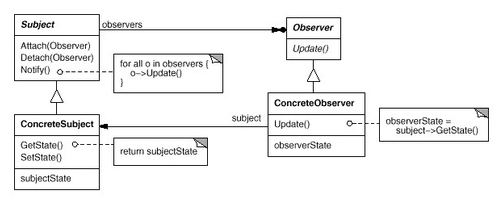
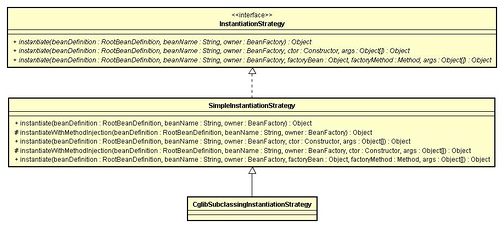

## Java

### HashMap 与 HashTable 区别与应用场景

HashMap理解

- HashMap 是一个散列桶（数组和链表），它存储的内容是键值对 key-value 映射
- HashMap 采用了数组和链表的数据结构，能在查询和修改方便继承了数组的线性查找和链表的寻址修改
- HashMap 是非 synchronized，所以 HashMap 很快
- HashMap 可以接受 null 键和值，而 Hashtable 则不能（原因就是 equlas() 方法需要对象，因为 HashMap 是后出的 API 经过处理才可以）
- HashMap 是基于 hashing 的原理，使用 put(key, value) 存储对象到 HashMap 中，使用 get(key) 从 HashMap 中获取对象。当给 put() 方法传递键和值时，先对键调用 hashCode() 方法，计算并返回的 hashCode 是用于找到 Map 数组的 bucket 位置来储存 Node 对象。

应用场景

推荐的HashMap应用场景是单线程运行环境，并且不需要遍历操作的场景。这个推荐场景不是硬性条件。比如多线程操作HashMap，通过加锁或者加入同步控制依然能正常应用HashMap，只是需要加上同步操作的代价。

多线程的环境推荐ConcurrentHashMap ，我们知道 Hashtable 是 synchronized 的，但是 ConcurrentHashMap 同步性能更好，因为它仅仅根据同步级别对 map 的一部分进行上锁ConcurrentHashMap 当然可以代替 HashTable，但是 HashTable 提供更强的线程安全性。它们都可以用于多线程的环境，但是当 Hashtable 的大小增加到一定的时候，性能会急剧下降，因为迭代时需要被锁定很长的时间。由于 ConcurrentHashMap 引入了分割（segmentation），不论它变得多么大，仅仅需要锁定 Map 的某个部分，其它的线程不需要等到迭代完成才能访问 Map。简而言之，在迭代的过程中，ConcurrentHashMap 仅仅锁定 Map 的某个部分，而 Hashtable 则会锁定整个 Map。

HashMap 与 HashTable 区别

- 继承和实现方式不同
  HashMap 继承于AbstractMap，实现了Map、Cloneable、java.io.Serializable接口。
  Hashtable 继承于Dictionary，实现了Map、Cloneable、java.io.Serializable接口。

- 默认容量不同
  HashMap**默认的容量大小是16**；增加容量时，每次将容量变为“原始容量x2”。
  Hashtable**默认的容量大小是11**；增加容量时，每次将容量变为“原始容量x2 + 1”。

- 线程安全性
  HashTable 安全

- 效率不同
  HashTable 要慢，因为加锁

- 对null值的处理不同
  HashMap的key、value**都可以为null**。
  Hashtable的key、value**都不可以为null**。

- 支持的遍历种类不同
  HashMap**只支持Iterator(迭代器)遍历。**
  而Hashtable**支持Iterator(迭代器)和Enumeration(枚举器)两种方式遍历。**

- 添加key-value时的hash值算法不同
  HashMap添加元素时，是使用**自定义的哈希算法。**
  Hashtable没有自定义哈希算法，而**直接采用的key的hashCode()。**

- 部分API不同
  Hashtable**支持contains(Object value)方法，而且重写了toString()方法**；
  而HashMap**不支持contains(Object value)方法，没有重写toString()方法。**

  

## Servlet

#### servlet执行流程

客户端发出http请求，web服务器将请求转发到servlet容器，servlet容器解析url并根据web.xml找到相对应的servlet，并将request、response对象传递给找到的servlet，servlet根据request就可以知道是谁发出的请求，请求信息及其他信息，当servlet处理完业务逻辑后会将信息放入到response并响应到客户端。

## 设计模式

单列模式，工厂模式，策略模式，共23种设计模式

## Spring5源码

###  浅谈spring中用到的设计模式及应用场景

**1. 简单工厂**

又叫做静态工厂方法（StaticFactory Method）模式，但不属于23种GOF设计模式之一。

简单工厂模式的实质是由一个工厂类根据传入的参数，动态决定应该创建哪一个产品类。

*Spring中的BeanFactory就是简单工厂模式的体现，根据传入一个唯一的标识来获得Bean对象，但是否是在传入参数后创建还是传入参数前创建这个要根据具体情况来定。*

 

 

**2. 工厂方法（Factory Method）**

定义一个用于创建对象的接口，让子类决定实例化哪一个类。Factory Method使一个类的实例化延迟到其子类。

*Spring中的FactoryBean就是典型的工厂方法模式*。如下图：

 

 

**3. 单例（Singleton）**

保证一个类仅有一个实例，并提供一个访问它的全局访问点。

Spring中的单例模式完成了后半句话，即提供了全局的访问点BeanFactory。但没有从构造器级别去控制单例，这是因为Spring管理的是是任意的Java对象。

 

**4. 适配器（Adapter）**

将一个类的接口转换成客户希望的另外一个接口。Adapter模式使得原本由于接口不兼容而不能一起工作的那些类可以一起工作。

Spring中在对于AOP的处理中有Adapter模式的例子，见如下图：

由于Advisor链需要的是MethodInterceptor（拦截器）对象，所以每一个Advisor中的Advice都要适配成对应的MethodInterceptor对象。

 

 

**5.包装器（Decorator）**

动态地给一个对象添加一些额外的职责。就增加功能来说，Decorator模式相比生成子类更为灵活。

Spring中用到的包装器模式在类名上有两种表现：一种是类名中含有Wrapper，另一种是类名中含有Decorator。基本上都是动态地给一个对象添加一些额外的职责。

 

 

**6. 代理（Proxy）**

为其他对象提供一种代理以控制对这个对象的访问。

从结构上来看和Decorator模式类似，但Proxy是控制，更像是一种对功能的限制，而Decorator是增加职责。

Spring的Proxy模式在aop中有体现，比如JdkDynamicAopProxy和Cglib2AopProxy。

 

 

**7.观察者（Observer）**

定义对象间的一种一对多的依赖关系，当一个对象的状态发生改变时，所有依赖于它的对象都得到通知并被自动更新。

Spring中Observer模式常用的地方是listener的实现。如ApplicationListener。

 

 

 

**8. 策略（Strategy）**

定义一系列的算法，把它们一个个封装起来，并且使它们可相互替换。本模式使得算法可独立于使用它的客户而变化。

Spring中在实例化对象的时候用到Strategy模式，见如下图：

在SimpleInstantiationStrategy中有如下代码说明了策略模式的使用情况：

 

 

 

**9.模板方法（Template Method）**

定义一个操作中的算法的骨架，而将一些步骤延迟到子类中。Template Method使得子类可以不改变一个算法的结构即可重定义该算法的某些特定步骤。

Template Method模式一般是需要继承的。这里想要探讨另一种对Template Method的理解。Spring中的JdbcTemplate，在用这个类时并不想去继承这个类，因为这个类的方法太多，但是我们还是想用到JdbcTemplate已有的稳定的、公用的数据库连接，那么我们怎么办呢？我们可以把变化的东西抽出来作为一个参数传入JdbcTemplate的方法中。但是变化的东西是一段代码，而且这段代码会用到JdbcTemplate中的变量。怎么办？那我们就用回调对象吧。在这个回调对象中定义一个操纵JdbcTemplate中变量的方法，我们去实现这个方法，就把变化的东西集中到这里了。然后我们再传入这个回调对象到JdbcTemplate，从而完成了调用。这可能是Template Method不需要继承的另一种实现方式吧。

以下是一个具体的例子：

JdbcTemplate中的execute方法：

JdbcTemplate执行execute方法：

**1、工厂模式，**在各种BeanFactory以及ApplicationContext创建中都用到了

**2、模版模式，**在各种BeanFactory以及ApplicationContext实现中也都用到了

**3、代理模式，**Spring AOP 利用了 AspectJ AOP实现的! AspectJ AOP 的底层用了动态代理

**动态代理有两种**

目标方法有接口时候自动选用 JDK 动态代理

目标方法没有接口时候选择 CGLib 动态代理

**4、策略模式，**加载资源文件的方式，使用了不同的方法，比如：ClassPathResourece，FileSystemResource，ServletContextResource，UrlResource但他们都有共同的借口Resource；在Aop的实现中，采用了两种不同的方式，JDK动态代理和CGLIB代理

**5、单例模式，**比如在创建bean的时候。

以上是本人查阅资料以及自己的一些理解，里面应该还有其他设计模式，总之还是要多敲多研究。

## Mybatis源码

## Tomcat源码

