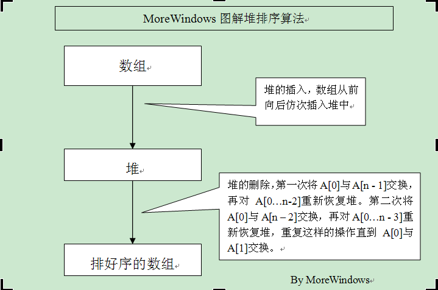
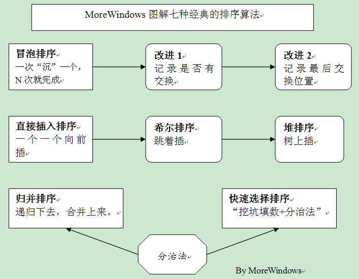
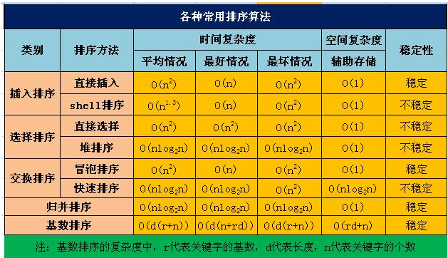

# 说一下几种常见的排序算法和分别的复杂度

各种排序的主要思路：
### 冒泡排序
通过交换使相邻的两个数变成小数在前大数在后，这样每次遍历后，最大的数就“沉”到最后面了。重复N次即可以使数组有序。
冒泡排序改进1：在某次遍历中如果没有数据交换，说明整个数组已经有序。因此通过设置标志位来记录此次遍历有无数据交换就可以判断是否要继续循环。
冒泡排序改进2：记录某次遍历时最后发生数据交换的位置，这个位置之后的数据显然已经有序了。因此通过记录最后发生数据交换的位置就可以确定下次循环的范围了。
### 直接插入排序
每次将一个待排序的数据，插入到前面已经排好序的序列之中，直到全部数据插入完成。
### 直接选择排序
数组分成有序区和无序区，初始时整个数组都是无序区，然后每次从无序区选一个最小的元素直接放到有序区的最后，直到整个数组变有序区。
上面这三种排序都是非常简单的，下面这四种排序略有难度，希望读者能多多实践以加深理解。
### 希尔排序
先将整个待排元素序列分割成若干个子序列（由相隔某个“增量”的元素组成的）分别进行直接插入排序，然后依次缩减增量再进行排序，待整个序列中的元素基本有序（增量足够小）时，再对全体元素进行一次直接插入排序。由于希尔排序是对相隔若干距离的数据进行直接插入排序，因此可以形象的称希尔排序为“跳着插”
### 归并排序
当一个数组左边有序，右边也有序，那合并这两个有序数组就完成了排序。如何让左右两边有序了？用递归！这样递归下去，合并上来就是归并排序。
### 快速排序
“挖坑填数+分治法”，首先令i =L; j = R; 将a[i]挖出形成第一个坑，称a[i]为基准数。然后j--由后向前找比基准数小的数，找到后挖出此数填入前一个坑a[i]中，再i++由前向后找比基准数大的数，找到后也挖出此数填到前一个坑a[j]中。重复进行这种“挖坑填数”直到i==j。再将基准数填入a[i]中，这样i之前的数都比基准数小，i之后的数都比基准数大。因此将数组分成二部分再分别重复上述步骤就完成了排序。
### 堆排序
堆排序主要思路用张图示来表示更好：

可见堆排序的难点就在于堆的的插入和删除。

#### 堆的插入
每次插入都是将新数据放在数组最后，而从这个新数据的父结点到根结点必定是一个有序的数列，因此只要将这个新数据插入到这个有序数列中即可。
#### 堆的删除
堆的删除就是将最后一个数据的值赋给根结点，然后再从根结点开始进行一次从上向下的调整。调整时先在左右儿子结点中找最小的，如果父结点比这个最小的子结点还小说明不需要调整了，反之将父结点和它交换后再考虑后面的结点。相当于从根结点开始将一个数据在有序数列中进行“下沉”。

因此，堆的插入和删除非常类似直接插入排序，只不是在二叉树上进行插入过程。所以可以将堆排序形容为“树上插”

### 常用的排序方法的关系

 

### 各算法的性能比较图

