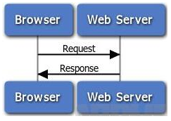
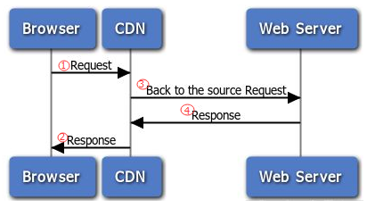
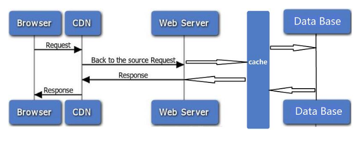
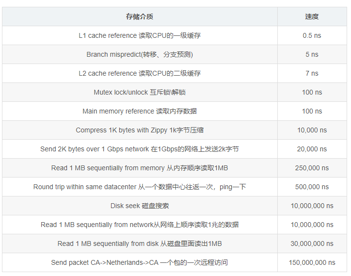

本文主要跟大家来探讨下缓存的应用场景有哪些？缓存给我们带来了哪些便利？同时又给我们带来了哪些问题？还有，简单介绍一些常用的缓存工具。JUST DO IT! GO!

## 缓存的应用场景
### CPU缓存
是位于CPU与内存之间的临时存储器，它的容量比内存小的多但是交换速度却比内存要快得多。(选用存储介质，提高访问速度：高速缓存>内存；减少重复量)

### 浏览器缓存
浏览器可以缓存一些静态资源，比如图片、js、css等，这些都是不常变化的内容，所以没有必要每次都去请求。（减少网络IO消耗，提高访问速度）

### CDN缓存
客户端会先检查浏览器的缓存，若缓存过期则会像CDN发送请求(Request)，CDN检查缓存数据还未过期，那么直接返回响应（Response），只需两步搞定。但是，CDN缓存过期，那么需要向应用服务器（Web Server）发起请求，获得新的数据响应，这部分新的数据按一定的缓存策略会选择是否缓存在CDN中。从下图可发现，此时数据需要完成1–>3–>4–>2最终返回到浏览器端。此处的CDN，（减少网络IO消耗，提高访问速度）

### 数据库缓存
我们看下图，在WebServer和DB之间加一层cache，这层cache一般选取的介质是内存，因为我们都知道存入数据库的数据都具有持久化的特点，那么读写会有磁盘IO的操作，内存的读写速度远比磁盘快得多。（选用存储介质，提高访问速度：内存>>磁盘；减少磁盘IO的操作，减少重复查询，提高吞吐量）

### 业务层缓存
除了上面介绍的缓存场景，我们还可能需要更细粒度的缓存，可以在上图的某个切面做更细致处理，下篇我们将从实践方面来探讨业务上的缓存。

存储介质访问速度比较　来自Google工程师Jeff Dean的分享，仅供参考：

| 存储介质                             | 速度   |
| ------------------------------------ | ------ |
| L1 cache reference 读取CPU的一级缓存    | 0.5 ns |
|Branch mispredict(转移、分支预测)	|5 ns|
|L2 cache reference 读取CPU的二级缓存	|7 ns|
|Mutex lock/unlock 互斥锁\解锁	|100 ns|
|Main memory reference 读取内存数据	|100 ns|
|Compress 1K bytes with Zippy 1k字节压缩	|10,000 ns|
|Send 2K bytes over 1 Gbps network 在1Gbps的网络上发送2k字节	|20,000 ns|
|Read 1 MB sequentially from memory 从内存顺序读取1MB	|250,000 ns|
|Round trip within same datacenter 从一个数据中心往返一次，ping一下	|500,000 ns|
|Disk seek 磁盘搜索	|10,000,000 ns|
|Read 1 MB sequentially from network从网络上顺序读取1兆的数据	|10,000,000 ns|
|Read 1 MB sequentially from disk 从磁盘里面读出1MB	|30,000,000 ns|
|Send packet CA->Netherlands->CA 一个包的一次远程访问	|150,000,000 ns|

## 缓存的工作原理
一句话概况：更快读写的存储介质+减少IO+减少CPU计算=性能优化。

通过上述应用场景（标红部分），我们可知缓存的基本原理就是通过这几个方面来进行优化的。

在实际应用中，我们需要对数据进行分类，才能更好的使用缓存以及一些策略来辅助。比如哪些为冷热数据？哪些数据量很大，读取会严重影响IO？哪些数据查多改少（日志数据，爬虫数据）？哪些数据又是经过很复杂的计算得到的结果（这些珍贵的数据需要好好保存利用）？……

## 缓存带来的好处
显而易见，缓存给我们带来最直接的体验就是“快”，我们来总结一下：

通过减少IO（包括磁盘和网络）来提高吞吐量，减少计算量（CPU计算）释放CPU，这些都是提高系统的响应速度。

通过切面的处理方式，可以在各层进行插拔，是所有性能优化最简单有效的解决方案。（对于不熟悉业务代码或算法的优化者，显然加一层缓存的复杂度和风险更低，而这一层看似简单的缓存，它给系统带来的性能优化有可能大大超过前者）

## 缓存带来的困扰
我们不能否认缓存给我们带来诸多便利，同时，我们不能忽略缓存确实也给我们带来了不少困扰：

数据的一致性、实时性受影响。（需要对数据的一致性，时效性进行评估，进而确定是否要缓存或设定缓存的过期时间，比如个性化的数据是否值得缓存？）

缓存介质带来的不可靠性。（一般使用内存做缓存的话，若机器故障，如何保证缓存的高可用？可考虑对缓存进行分布式做成高可用，同时，需要接受这种不可靠不安全会给数据带来的问题，在异常情况下进行补偿处理，定期持久化等方式）

缓存的数据使得更难排查问题。因为缓存命中是随着访问随时变化的，缓存的行为难以重现，使得出现BUG很难排查。

进程内缓存可能会增加GC压力：在具有垃圾收集功能的语言中（如java），大量长寿命的缓存对象会增加垃圾收集的时间和次数。

我前面提到的，使用缓存之前我们需要对数据进行分类，对访问行为进行预估，思考哪些数据需要缓存，缓存时需要采用什么策略？这样，我们才不被缓存所困扰，才能规避这些问题。

## 常用的缓存工具
业务上缓存，常用开源的缓存工具有：ehcache、memcache、redis。

ehcache 是一个纯Java的进程内缓存框架，hibernate使用其做二级缓存。同时，ehcache可以通过多播的方式实现集群。本人主要用于本地的缓存，数据库上层的缓存。

memcache是一套分布式的高速缓存系统，提供key-value这样简单的数据储存，可充分利用CPU多核，无持久化功能。本人在做web集群的时候用过，主要做session共享，页面对象缓存。

redis高性能的key-value系统，提供丰富的数据类型，单核CPU有抗并发能力，有持久化和主从复制的功能。本人主要使用redis的redis sentinel，根据不同业务分为多组。

---------------------
作者：MusicMaster 
来源：CSDN 
原文：https://blog.csdn.net/liaoyulin0609/article/details/51762935 
版权声明：本文为博主原创文章，转载请附上博文链接！