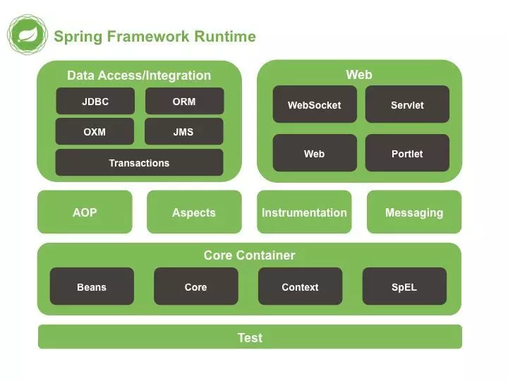

## 为什么要阅读源码

学习编程不是学习配置东西，需要多看看底层的知识，《Java编程思想》里有一句深刻的话，“编程语言是程序员的表达的方式，而架构是程序员对世界的认知”。 

## 怎么阅读源码

Spring框架包含了非常多的功能，不能漫无目地阅读，可以针对性阅读部分源码。
针对性阅读如下部分：
Spring架构
Spring模块
Spring运用的设计模式

## Spring框架

Spring 是一个开源框架，是为了解决企业应用程序开发复杂性而创建的。
框架的主要优势之一就是其分层架构，分层架构允许您选择使用哪一个组件，
同时为 J2EE 应用程序开发提供集成的框架

Spring框架由如下7个模块构成，组成 Spring 框架的每个模块（或组件）都可以单独存在，或者与其他一个或多个模块联合实现。

## Spring模块功能

#### 核心容器(Spring core)

核心容器提供Spring框架的基本功能。Spring以bean的方式组织和管理Java应用中的各个组件及其关系。Spring使用BeanFactory来产生和管理Bean，它是工厂模式的实现。BeanFactory使用控制反转(IoC)模式将应用的配置和依赖性规范与实际的应用程序代码分开。BeanFactory使用依赖注入的方式提供给组件依赖。

#### Spring上下文(Spring context)

Spring上下文是一个配置文件，向Spring框架提供上下文信息。Spring上下文包括企业服务，如JNDI、EJB、电子邮件、国际化、校验和调度功能。

#### Spring面向切面编程(Spring AOP)

通过配置管理特性，Spring AOP 模块直接将面向方面的编程功能集成到了 Spring框架中。所以，可以很容易地使 Spring框架管理的任何对象支持 AOP。Spring AOP 模块为基于 Spring 的应用程序中的对象提供了事务管理服务。通过使用 Spring AOP，不用依赖 EJB 组件，就可以将声明性事务管理集成到应用程序中。

#### Spring DAO模块

DAO模式主要目的是将持久层相关问题与一般的的业务规则和工作流隔离开来。Spring 中的DAO提供一致的方式访问数据库，不管采用何种持久化技术，Spring都提供一直的编程模型。Spring还对不同的持久层技术提供一致的DAO方式的异常层次结构。

#### Spring ORM模块

Spring 与所有的主要的ORM映射框架都集成的很好，包括Hibernate、JDO实现、TopLink和IBatis SQL Map等。Spring为所有的这些框架提供了模板之类的辅助类，达成了一致的编程风格。
Spring 框架插入了若干个 ORM 框架，从而提供了 ORM 的对象关系工具，其中包括 JDO、Hibernate 和 iBatis SQL Map。所有这些都遵从 Spring 的通用事务和 DAO 异常层次结构。

#### Spring Web模块

Web上下文模块建立在应用程序上下文模块之上，为基于Web的应用程序提供了上下文。Web层使用Web层框架，可选的，可以是Spring自己的MVC框架，或者提供的Web框架，如Struts、Webwork、tapestry和jsf。
Web 模块还简化了处理多部分请求以及将请求参数绑定到域对象的工作。

#### Spring MVC框架(Spring WebMVC)

MVC框架是一个全功能的构建Web应用程序的MVC实现。通过策略接口，MVC框架变成为高度可配置的。Spring的MVC框架提供清晰的角色划分：控制器、验证器、命令对象、表单对象和模型对象、分发器、处理器映射和视图解析器。Spring支持多种视图技术，其中包括 JSP、Velocity、Tiles、iText 和 POI。

## Spring运用的设计模式

